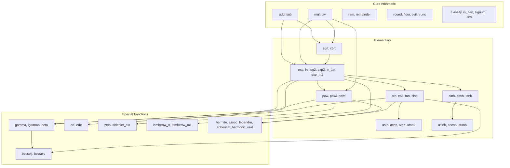

# MpFloat Implementation Planning

## -1. Product Goal (Non-Negotiable UX)
`MpFloat` exists so users can set target precision once and then write numerical algorithms normally, without manually carrying guard bits through every call.

Primary goal:
- Users configure result precision through explicit constructors, scoped context, or global default.
- Public operations return values rounded to the resolved target precision.
- Implementations own working precision and guard-bit selection internally.
- Expert APIs may override working precision, but ordinary users should not need to know how many guard bits a special function needs.

Special-functions goal:
- The crate aims to provide a broad special-functions surface so users do not have to reimplement numerically delicate algorithms.
- If the crate exposes a special function, the crate owns its argument reduction, domain handling, guard-bit policy, convergence strategy, and final rounding.
- The public API must distinguish stable contracts from experimental functions whose algorithms or signatures may still evolve.

## Type Definition
- **Type**: `InternalMpFloat`
- **Description**: The core data structure for arbitrary precision floating-point numbers.
- **Implementation Strategy**:
  - **Precision Model**: Precision is specified and stored in binary bits. Decimal-digit helpers may exist, but they are convenience constructors that convert to bits before creating the value.
  - **IEEE-754 Alignment (V1 Contract)**: Arithmetic follows IEEE-754 semantics as closely as possible from the start: rounding modes, signed zero, infinities, NaNs, exception flags, total ordering, fused multiply-add, IEEE remainder, and classification predicates.
  - **Zero Policy**: `+0` and `-0` are both represented and observable where IEEE-754 requires them. Integer and rational types still canonicalize zero; this signed-zero behavior is float-only.
  - **Special Values**: `+inf`, `-inf`, quiet NaN, and signaling NaN are supported. Sign/payload preservation is best-effort and deterministic.
  - **Exponent Policy**: Default `MpFloat` has arbitrary precision and an effectively unbounded exponent, limited by allocation/resource errors. Exponent is bounded to `[i64::MIN, i64::MAX]`; values requiring larger exponents return `ExponentOverflow`. IEEE-style overflow, underflow, and subnormal behavior require a bounded `FloatFormat` with explicit `emin` / `emax`.
  - **Proposed Structure**:
    ```rust
    pub enum FloatClass {
        Finite,
        Subnormal,
        Zero,
        Infinity,
        QuietNaN,
        SignalingNaN,
    }

    pub struct FloatFormat {
        /// Optional minimum exponent for IEEE-style bounded formats.
        pub emin: Option<i64>,
        /// Optional maximum exponent for IEEE-style bounded formats.
        pub emax: Option<i64>,
    }

    pub struct InternalMpFloat {
        /// Independent sign bit, aligned with IEEE 754.
        pub(crate) sign: Sign,
        /// Finite/infinite/NaN classification.
        pub(crate) class: FloatClass,
        /// The unsigned mantissa stored as standard fast binary limbs.
        pub(crate) mantissa: InternalMpUint,
        /// The exponent in base-2 (source of truth). Bounded to i64 limits.
        pub(crate) exp: i64,
        /// The target precision in binary bits (source of truth).
        pub(crate) precision_bits: u64,
        /// Optional bounded exponent format.
        pub(crate) format: Option<FloatFormat>,
        /// Optional NaN payload for deterministic propagation/debugging.
        pub(crate) nan_payload: Option<u64>,
    }
    ```

## Trait Methods (`MpFloatTrait`)

### 1. Precision Management Hierarchy
> [!WARNING]
> Async concurrency and `PrecisionGuard`: Like `MpInt`, a `thread_local!`-based `PrecisionGuard` in a work-stealing async runtime is **actively dangerous**. `PrecisionGuard` should be clearly documented as unsound/unsafe for tasks moving across threads.

- **Hierarchy Rules**: Precision is determined by a strict priority system. When two values interact, the **smaller precision always wins** (acting as a "taint" to prevent a false sense of accuracy).
  1. **Variable-Specific Precision**: Variables can have explicitly set precision (e.g., `x.set_precision(53)`).
  2. **Scoped Context Precision**: A temporary precision context that overrides the global setting for a specific block of code.
  3. **Global Precision**: The fallback baseline precision if nothing else is specified.
- `prec` (Get current variable precision).
- `set_prec` (Set variable precision).

### 2. Rounding Mode
- Default rounding mode is IEEE-754 `NearestTiesEven`.
- V1 supports the IEEE rounding directions: `NearestTiesEven`, `TowardZero`, `TowardPositive`, `TowardNegative`, and `NearestTiesAway`.
- Rounding mode is resolved from explicit operation options, scoped context, global default, then `NearestTiesEven`.
- Every conversion from exact values (`MpInt`, `MpUint`, `MpRational`) into `MpFloat` uses the resolved target precision and rounding mode.
- `f32` / `f64` inputs are first decoded as exact IEEE values, including infinities and NaN, then represented as `MpFloat`.

### 3. IEEE Exception Flags
- V1 tracks IEEE-style sticky exception flags in the active float context (thread-local by default).
- Flags: `Invalid`, `DivisionByZero`, `Overflow`, `Underflow`, `Inexact`.
- **API**:
  - `FloatFlags::get()` -> `FloatFlags`
  - `FloatFlags::clear()`
  - `FloatFlags::set(flag)`
  - `FloatFlags::test(flag) -> bool`
- Plain operations set flags and return IEEE values where possible.
- Fallible `try_*` APIs return structured errors for resource limits, unsupported domains, convergence failure, and format constraints that are not ordinary IEEE arithmetic events.
- In unbounded-exponent formats, arithmetic overflow/underflow flags generally do not occur except when an explicit bounded `FloatFormat` is active.

### 4. Working Precision & Guard Bits
- **Target precision** is the precision visible on the returned `MpFloat`.
- **Working precision** is an internal temporary precision selected per operation: `target_precision + guard_bits`.
- Guard bits are dynamic. They depend on argument magnitude, range reduction, cancellation risk, recurrence stability, asymptotic expansion truncation, and conversion/rounding requirements.
- Special functions must not expose guard-bit plumbing in their normal APIs.
- Expert overrides:
  - `with_working_precision(bits, f)`
  - `with_guard_bits(bits, f)`
  - `try_with_accuracy(goal: AccuracyGoal, f) -> Result<MpFloat, MpFloatError>` (where `AccuracyGoal` can be `Bits(u64)`, `Ulps(u32)`, or `RelativeError(MpFloat)`).
- Implementations may retry with increased working precision until the result is stable, a proof/heuristic bound succeeds, or a configured resource limit is reached.
- If stability cannot be established, fallible APIs return `PrecisionExhausted`, `NoConvergence`, or `CancellationRisk` rather than silently pretending the requested accuracy was achieved.

### 5. Accuracy Policy
- The default target for elementary and special functions is **faithful rounding**: the returned value is one of the nearest representable values at target precision, generally within 1 ULP.
- Correct rounding is a stronger per-function/per-domain contract and should be documented only where the implementation can actually guarantee it.
- Some functions and domains may initially provide an empirical guarantee backed by exhaustive or randomized testing against trusted backends such as FLINT intervals and rug.
- Each special function must eventually declare one of:
  - `CorrectlyRounded`
  - `Validated0Ulp`
  - `FaithfullyRounded`
  - `Almost1Ulp`
  - `BestEffortExperimental`
- `Validated0Ulp` means the implementation has been cross-checked against trusted interval/reference bounds and always rounded to the same target result in the tested domain. It is not the same as a self-contained proof of correct rounding for every input.
- The user-facing promise is that normal APIs manage guard bits automatically; the exact accuracy tier is part of the function contract.

### 6. Core Arithmetic
- `add` / `sub` / `mul` / `div`: Standard operations.
- `mul_add` / `fma` (Fused multiply-add): Computes `a * b + c` with one final rounding, IEEE-style.
- `rem` / `remainder`: `%` follows Rust/operator remainder semantics. `remainder` exposes IEEE remainder semantics.
- `next_up` / `next_down` / `next_after`: Adjacent representable values under the active format.
- `scaleb` / `logb` / `ilogb`: IEEE-style exponent scaling and extraction.
- `frexp`: Decomposes into mantissa and exponent.
- `modf`: Decomposes into integer and fractional parts.

### 7. Elementary & Core Math Functions
- `abs`, `signum`: Exact classification/sign operations. `signum(NaN)` returns `NaN`. `signum(+0)` returns `+0`; `signum(-0)` returns `-0` *(Note: this diverges from Rust primitive `f64::signum` which returns -1.0 for -0.0, to maintain exact IEEE 754 parity).*
- `copysign`, `is_nan`, `is_signaling`, `is_infinite`, `is_finite`, `is_normal`, `is_subnormal`, `is_zero`, `classify`: IEEE-style classification.
- `sqrt` / `cbrt` (Square & Cube Root).
- `hypot`: $\sqrt{x^2 + y^2}$, computed avoiding intermediate overflow/underflow.
- `exp` / `ln` / `log(base, x)` / `log2` / `log10`.
- `exp2` / `exp10`.
- `ln_1p` / `exp_m1`: Numerically stable for values near zero.
- `pow`, `powi`, `powf`, `pow_u(n: u64)`, `pow_i(n: i64)`.
- `sin` / `cos` / `tan` / `cot` / `sec` / `csc`.
- `asin` / `acos` / `atan` / `atan2` / `acot` / `asec` / `acsc`.
- `sinh` / `cosh` / `tanh` / `coth` / `sech` / `csch`.
- `asinh` / `acosh` / `atanh` / `acoth` / `asech` / `acsch`.
- `sinc`: Defined as $\sin(x)/x$ (and 1 at $x=0$).

### 8. Rounding Operators
- `round` / `floor` / `ceil` / `trunc`: Round to integer float values.

### 9. Parsing & Formatting
- `from_str_radix` / `to_string_radix`.

### 10. Comparisons
- `cmp` / `eq` (Equality and Ordering): IEEE-style `PartialEq` / `PartialOrd`: `NaN != NaN`, comparisons with `NaN` return unordered, and `+0 == -0`.
- Provide `total_cmp` / `total_order` for deterministic total ordering including signed zero and NaNs.

### 11. Special Functions (Initial Algorithms Available)
- `lambertw_0` / `lambertw_m1`: Lambert W function branches $W_0$ (principal, $x \ge -1/e$) and $W_{-1}$ ($-1/e \le x < 0$).
- **Error Functions**: `erf`, `erfc`.
- **Gamma Family**: `gamma`, `lgamma`, `digamma`, `trigamma`, `tetragamma`, `polygamma(n, x)`, `beta(a, b)`.
- **Zeta**: `zeta`, `zeta_deriv(n, s)`. *Note: `zeta(1.0)` evaluates to the pole at 1, returning `+inf` with the `DivisionByZero` flag set.*
- **Bessel**: `besselj(n, x)`, `bessely(n, x)`, `besseli(n, x)`, `besselk(n, x)`.
- **Elliptic Integrals**: `elliptic_k`, `elliptic_e`.
- **Orthogonal Polynomials**: `hermite(n, x)`, `assoc_legendre(l, m, x)`. *Note: `assoc_legendre` evaluates the standard real function for $|x| \le 1$ and returns `DomainError` for $|x| > 1$.*
- **Spherical Harmonics**: `spherical_harmonic_real(l, m, θ, φ)`, `ynm_real(l, m, θ, φ)`. *Note: these use the real-valued spherical harmonic convention (combinations of sin/cos for $m \neq 0$).*

### 11.1 Real-Only Branch Policy
- V1 is a real-valued float API. The crate does not expose `MpComplex` yet.
- Functions with complex analytic continuations use the documented real/principal branch and return the real component when a real-only convention is chosen.
- If returning only the real component would hide an important domain/branch issue, fallible variants should expose `ComplexResult`, `BranchCut`, or `DomainError`.
- A future `MpComplex` abstraction may provide full complex-valued results without changing the real API's documented branch contracts.

### 12. Special Functions Objective (New Algorithms to Develop)
- **Factorial Family**: `factorial`, `double_factorial`, `subfactorial`. Exact integer variants live on `MpUint` / `MpInt`; float variants use gamma/analytic continuation where mathematically meaningful.
- **Exponential & Logarithmic Integrals**: `ei(x)`, `li(x)`.
- **Trigonometric & Hyperbolic Integrals**: `si(x)`, `ci(x)`, `shi(x)`, `chi(x)`.
- **Hypergeometric Functions**: `hyp1f1(a, b, x)`, `hyp2f1(a, b, c, x)`, `meijerg`.
- **Advanced Error Functions**: `erfi(x)`, `fresnel_s(x)`, `fresnel_c(x)`, `dawson(x)`.
- **Incomplete Functions**: `upper_gamma(a, x)`, `lower_gamma(a, x)`, `inc_beta(a, b, x)`.
- **Multivariate Gamma**: `multigamma`.
- **Advanced Polynomials**: `laguerre(n, alpha, x)`, `chebyshev_t(n, x)`, `chebyshev_u(n, x)`, `jacobi(n, alpha, beta, x)`.
- **Polylogarithm & Others**: `polylog(n, x)`, `airy_ai(x)`, `airy_bi(x)`, `struve_h(v, x)`, `struve_l(v, x)`.
- **Dirichlet Functions**: `dirichlet_eta(s)`.

### 13. Ecosystem & Integrations (Native Ergonomics)
- **Operator Overloading (`std::ops`)**: `Add`, `Sub`, `Mul`, `Div`, `Rem`, `Neg`, and their `*Assign` variants.
- **Standard Conversions**: `From` / `Into` / `TryFrom` for native types (`f32`, `f64`, `u64`, `i64`, etc.).
- **Formatting & Parsing**: `Display`, `Debug`, `FromStr`.
- **Equality & Hashing**: `PartialEq`, `PartialOrd`, and explicit `total_cmp`. Do not implement normal `Eq` / `Ord` while `NaN` follows IEEE semantics. Hashing and total equality are exposed through an explicit wrapper `TotalMpFloat(MpFloat)`, which implements `Eq + Ord + Hash` via `total_cmp` (where `NaN == NaN` and `NaN` is greater than everything).
- **Optional Features**: `serde` (`Serialize`, `Deserialize`) and `pyo3` (Python bindings).
  - *Serde format*: Uses a canonical struct: `{ sign: i8, mantissa_limbs: Vec<u64>, exponent: i64, precision_bits: u64 }`.
- **Constants**: High-precision constants (`PI`, `E`, `TAU`, `LN_2`). 
  - *Caching Strategy*: Constants use a thread-local cache mapped by precision. When a constant is requested at precision $P$, it evaluates at $P$. If requested at $P' < P$, it rounds the cached value. If $P' > P$, it re-evaluates and updates the cache.
- **Precision Management & Accuracy Guarantee**: The backend resolves target precision dynamically using the hierarchy (Variable > Context > Global). The smaller precision always acts as a "taint" in cross-value operations. Working precision and guard bits are selected internally. Accuracy is declared per function using the tiers in section 5; do not globally promise 0 ULP for every special function.

### 13.1 `no_alloc` and `INLINE_BITS`
Like `MpInt`, `MpFloat` supports `INLINE_BITS` for stack allocation of the mantissa. Without the `alloc` feature, precision is strictly bounded by `INLINE_BITS`. Operations requiring precision beyond `INLINE_BITS` in a `no_alloc` context will return `AllocationRequired` or panic, depending on the operator.

## 14. Errors
```rust
pub enum MpFloatError {
    PrecisionExhausted,
    NoConvergence,
    CancellationRisk,
    ComplexResult,
    BranchCut,
    DomainError,
    ExponentOverflow,
    AllocationRequired,
}

pub enum AccuracyGoal {
    Bits(u64),
    Ulps(u32),
    RelativeError(InternalMpFloat),
}
```

## 15. Implementation Phases
The development of `MpFloat` follows a strict phase progression:
1. **Phase 1 (Core)**: Precision contexts, FloatFormat, exception flags, basic operators (`add`, `sub`, `mul`, `div`, `rem`), `sqrt`, `cbrt`, parsing, formatting, and comparisons.
2. **Phase 2 (Elementary)**: Trigonometric (`sin`, `cos`, `tan`), inverse trig, exponential/logarithm (`exp`, `ln`, `exp2`), hyperbolic functions, powers (`powi`, `powf`), and `sinc`.
3. **Phase 3 (Special 1)**: Gamma family, Error functions (`erf`, `erfc`), Zeta, and Lambert W branches.
4. **Phase 4 (Special 2)**: Bessel functions, Elliptic integrals, Airy functions, and Fresnel.
5. **Phase 5 (Orthogonal & Hypergeometric)**: Hermite, Legendre, Laguerre, Chebyshev, spherical harmonics, and generic hypergeometric functions (`hyp1f1`, `hyp2f1`).

## 16. Internal Function Dependency Graph



