# Advanced integer algorithms: requirements and candidate methods

> [!NOTE]
> This document is a **non-normative algorithmic roadmap and design reference**.
> [`spec.md`](spec.md) defines design contracts; [`api-inventory.md`](api-inventory.md)
> records implemented APIs. Candidate signatures and algorithms below are planned.

This document identifies the mathematical algorithms and internal subsystems
required by planned number-theoretic and combinatorial APIs. Existing kernels
are listed separately from candidate implementations and reference interfaces.

---

## 1. Implemented foundations and planned operations

`MpAnafis` implements integer arithmetic, a multiplication tower from basecase
through Karatsuba, Toom-Cook, and Schönhage–Strassen transforms, division through
Algorithm D, Burnikel–Ziegler, and Newton reciprocals, recursive half-GCD,
Montgomery and Barrett reduction, and primality screening. Primality is exact
through `u64::MAX`; larger inputs receive probable-prime classification.

Planned APIs in [`spec.md`](spec.md) require additional algorithms:

1. **Integer Factorization & Divisor Structures**: Multi-stage cascade (Wheel Trial Division $\to$ Pollard's $\rho$ $\to$ Pollard's $p-1$ $\to$ Lenstra ECM).
2. **Sub-Quadratic Batch GCD**: Bernstein balanced product and scaled remainder trees, followed by per-input GCDs.
3. **Modular Equations & Group Structures**: Modular square root (Tonelli–Shanks / Cipolla / Hensel / CRT), Discrete Logarithms (Pohlig–Hellman / BSGS / Pollard $\rho$ over $\operatorname{ord}_m(g)$), Multiplicative Order, Primitive Roots, and Garner's Mixed-Radix Chinese Remainder Theorem.
4. **Exact Higher-Degree Roots & Powers**: Coupled Zimmermann $n$-th root with remainder (`nth_root_rem`), and Bach–Sorenson / Bernstein prime-power screening (`is_perfect_power`, `is_prime_power`).
5. **Asymptotic Combinatorics & Special Functions**: Kummer carry-counting prime-power trees for binomial coefficients, binary splitting product trees for primorials, fast matrix doubling for Fibonacci and Lucas sequences, Euler pentagonal recurrence and certified ball-bounded Hardy–Ramanujan–Rademacher expansion for integer partitions, and Clausen–von Staudt / Akiyama–Tanigawa for Bernoulli numbers.

---

## 2. Reference interfaces

The following primary references provide comparison targets for API design.
Their interfaces do not establish equivalent implementation algorithms or
performance. Links were reviewed on 2026-10-05; live documentation may change.

| Operation | `MpAnafis` status | Reference interface |
| --- | --- | --- |
| Square root and remainder | Implemented as `sqrt_rem` | GMP `mpz_sqrtrem`; Rug `sqrt_rem`. |
| General root and remainder | `nth_root` implemented; `nth_root_rem` planned | GMP `mpz_rootrem`; Rug `root_rem`. |
| Perfect-power detection | Planned | GMP `mpz_perfect_power_p`. |
| Primality | Exact through u64; probable above it | Rug `is_probably_prime` distinguishes composite, probable, and proven results. |
| General factorization | Public engine planned; totient has internal factoring | FLINT `fmpz_factor` and `fmpz_factor_ecm`. |
| Smooth factor extraction | Planned | FLINT `fmpz_factor_smooth`; this factors up to a bound and may leave a composite cofactor. |
| Modular square root | Planned | FLINT `fmpz_sqrtmod` assumes a prime modulus. |
| Multiplicative order and discrete logarithm | Planned | PARI/GP `znorder` and `znlog`. |
| Primorial and integer sequences | Planned | GMP `mpz_primorial_ui`, `mpz_fib_ui`, and `mpz_lucnum_ui`. |
| Bernoulli numbers | Planned; requires rationals | FLINT `arith_bernoulli_number`. |

Sources: [GMP function index](https://gmplib.org/manual/Function-Index),
[Rug Integer](https://docs.rs/rug/1.30.0/rug/struct.Integer.html),
[FLINT factorization](https://flintlib.org/doc/fmpz_factor.html),
[FLINT integers](https://flintlib.org/doc/fmpz.html),
[FLINT arithmetic functions](https://flintlib.org/doc/arith.html), and
[PARI/GP arithmetic functions](https://pari.math.u-bordeaux.fr/dochtml/html-stable/Arithmetic_functions.html).

[num-bigint's BigUint API](https://docs.rs/num-bigint/0.5.1/num_bigint/struct.BigUint.html)
provides integer roots, modular exponentiation, and modular inversion. Its
public method inventory is distinct from the factorization and primality
interfaces above; undocumented internal algorithms are not comparison claims.

---


## 3. Inventory of Existing Foundations in `MpAnafis`

The planned operations can reuse the following implementations:

| Subsystem | Existing Components | Implementation Details | Code Location |
|---|---|---|---|
| **Multiplication Tower** | Basecase, Karatsuba, Toom-3, Toom-4, Toom-6, Toom-8.5, Schönhage–Strassen (SSA) | Negacyclic FFT over Fermat ring $\mathbb{Z}/(2^{2^m}+1)\mathbb{Z}$, L2-cache-blocked square-root stepping, truncated and low-product routines. | `src/int/logic/unsigned/math/mul/` |
| **Division Tower** | Möller–Granlund 3/2, Knuth Algorithm D, Burnikel–Ziegler, block-wise Barrett division with Newton reciprocals | Quotient-only basecases shorten successive divisor windows, reuse the reciprocal's two-limb remainder, retain two guard limbs, and correct only omitted triangular products when the error bound is ambiguous. Full basecase steps subtract through the architecture kernel. Recursive kernels remove leading zero-or-one quotient digits before partitioning. Newton refinement truncates its error product; large remainders use products modulo $B^w-1$ with exact reconstruction. Quotient blocks write directly to output, while remainder-only calls omit their assembly. Final quotient-only blocks use reciprocal guard precision with exact fallback for ambiguous rounding. Known exact divisions use low-to-high scalar cancellation, prefix truncation, or two-bit final Newton correction. | `src/int/logic/unsigned/math/div/` |
| **GCD & Inverses** | One- and two-limb binary GCD, Lehmer simulation, recursive high-half HGCD, extended GCD | Sub-quadratic $O(M(N) \log N)$ HGCD reduction. Extended GCD retains transition matrices, batches growing cofactors, and tracks the smaller cofactor family for unequal operand widths. Initial remainder reduction avoids cofactor setup for wide exact multiples. Empirical width policies select simulation and batching. The kernel returns absolute Bézout coefficients; the signed API applies signs directly and the unsigned API constructs residue representatives. | `src/int/logic/unsigned/math/gcd/`, `div/extended.rs`, `div/bezout.rs` |
| **Modular Domains** | Montgomery REDC, Barrett reduction, `pow_mod`, `jacobi_symbol` | Reusable modular workspaces, windowed exponentiation, and recursive Jacobi symbols. Wide Montgomery reduction uses a radix inverse, a low product, and an exact high product reconstructed from a cyclic product when admitted; geometric inverse refinement costs O(M(n)). Small domains use scalar cancellation. Jacobi shares Lehmer simulation and HGCD reduction with GCD, commits its six-bit sign state with each accepted matrix, and finishes with binary single-limb reduction. One-shot Barrett reduction uses direct remainder division for quotients fitting one limb and inputs beyond the reciprocal range. | `src/int/logic/unsigned/math/modular/`, `gcd/jacobi.rs` |
| **Primality & Roots** | Deterministic $u64$, 64-base Miller–Rabin, Baillie–PSW, Zimmermann `isqrt`, Newton `nth_root` | Baillie–PSW with Selfridge Lucas search, bit-sieved `next_prime`, coupled recursive square root with remainder (`sqrt_rem`), Newton integer $n$-th root. | `src/int/logic/unsigned/math/primes/`, `roots/` |
| **Special Combinatorics** | `factorial`, `product_of_odds` | Moessner/Legendre 2-valuation shift, recursive binary splitting product tree over odd factor intervals. | `src/int/logic/unsigned/math/theory/factorial.rs` |
| **Totient Factorization** | Prime trial division, square-cofactor reduction, Pollard–Brent, batch GCD | Internal to `euler_phi`. Native trial factors use precomputed modular inverses; wide exact divisions fuse the totient update with quotient extraction. Trial factors are removed completely, and recursive square cofactors reduce to their roots. Pollard uses native Montgomery arithmetic or wide Barrett reduction, skips checkpoint-prefix products, and replays failed batches. A public, standalone factorization engine remains planned. | `src/int/logic/unsigned/math/theory/trial.rs`, `theory/totient.rs` |

---

## 4. Unimplemented APIs & Required Complex Algorithms

### 4.1. Integer Factorization & Divisor Structures

#### Target APIs
- `factor(&self) -> Vec<(MpUint, usize)>`
- `prime_factors(&self) -> Vec<MpUint>`
- `divisors(&self) -> Vec<MpUint>`, `divisor_count(&self) -> MpUint`, `divisor_sum(&self) -> MpUint`
- `is_squarefree(&self) -> bool`, `radical(&self) -> MpUint`
- `is_smooth(&self, b: &Self) -> bool`
- `remove_factor(&self, factor: &Self) -> (Self, usize)`

#### Algorithmic Strategy
General integer factorization requires a cascading multi-stage pipeline:

The example bounds below are candidate work budgets, not measured tuning values.

```
Input n
  │
  ├── 1. Trial Division (2-3-5 Wheel Sieve up to B_0 ≈ 50,000)
  │      └── Removes all small prime factors.
  │
  ├── 2. Primality Gate (Baillie–PSW)
  │      └── Record a surviving cofactor with its primality qualification.
  │
  ├── 3. Pollard's Rho (Brent Cycle Detection + Batch GCD)
  │      └── Searches for a proper factor within a bounded work budget.
  │
  ├── 4. Pollard's p - 1 (Two-Stage BSGS Continuation)
  │      └── Extracts factors where p - 1 is B_1-smooth, with B_2 giant steps.
  │
  └── 5. Lenstra's Elliptic Curve Method (ECM)
         └── Suyama-parameterized Montgomery curves with Stage 1 ladder & Stage 2 Chebyshev continuation.
```

1. **Extraction of Existing Siloed Routine**:
   `src/int/logic/unsigned/math/theory/trial.rs` implements prime-only trial factorization. `theory/totient.rs` contains square-cofactor reduction and Pollard–Brent, using native Montgomery arithmetic or wide Barrett reduction with batches of at most 128 products. Each polynomial has a bounded evaluation budget; exhausted retries return `None`. The standalone factorization design extracts this logic into `src/int/logic/unsigned/math/factor/`.
2. **Pollard's $p - 1$ (Stages 1 & 2)**:
   - **Stage 1**: For bound $B_1 \approx 10^5$, compute $M = \prod_{q \le B_1} q^{\lfloor \log_q B_1 \rfloor}$ using the binary splitting product tree. Evaluate $a^M - 1 \pmod n$.
   - **Stage 2**: For prime difference steps in $(B_1, B_2]$, evaluate $\gcd(a^{M q} - 1, n)$ using baby-step giant-step table lookups to avoid exponentiations.
3. **Lenstra's Elliptic Curve Factorization (ECM)**:
   - For composite residues surviving the Pollard $\rho$ and $p-1$ budgets.
   - **Curve Selection**: Montgomery projective curves $B Y^2 Z = X^3 + A X^2 Z + X Z^2$ over $\mathbb{Z}/n\mathbb{Z}$ with Suyama's parameterization to enforce a torsion group with order divisible by 12.
   - **Stage 1**: Scalar point multiplication $k \cdot P$ using projective addition/doubling ladders requiring only $X$ and $Z$ coordinates (completely eliminating $Y$ coordinates and modular inversions).
   - **Stage 2**: Standard continuation over $[B_1, B_2]$ using Chebyshev polynomial evaluation.
4. **Downstream Divisor Structures**:
   - `factor`: Returns canonical prime factors with multiplicities $[(p_1, e_1), (p_2, e_2), \dots, (p_m, e_m)]$, sorted in ascending order.
     - *Primality Classification*: Factors through `u64::MAX` are classified exactly. Larger factors passing Baillie–PSW are probable primes; certification requires a separate proof or certificate.
     - All downstream functions (`divisors`, `euler_phi`, `carmichael_lambda`, `moebius_mu`, etc.) inherit this exact contract.
   - `divisors`: Evaluated by Cartesian expansion over prime-power sets $\{p_i^0, p_i^1, \dots, p_i^{e_i}\}$.
   - `divisor_count`: $\prod_{i=1}^m (e_i + 1)$.
   - `divisor_sum`: $\prod_{i=1}^m \frac{p_i^{e_i + 1} - 1}{p_i - 1}$, computed via exact division.
   - `is_squarefree`: all exponents equal one; the empty factorization of one satisfies this condition.
   - `radical`: $\prod_{i=1}^m p_i$.
   - `remove_factor`: Repeatedly divides by `factor` using `div_rem_into` until the remainder is nonzero, returning $(n / \text{factor}^k, k)$.

---

### 4.2. Sub-Quadratic Batch GCD

#### Target API
- `batch_shared_factor_detection(values: &[MpUint]) -> Vec<MpUint>`

#### Algorithmic Strategy: Bernstein's Product & Remainder Trees
Given $k$ positive integers of at most $N$ bits, pairwise factor detection
requires $\binom{k}{2}$ GCDs, costing $O(k^2 G(N))$ where $G$ is GCD cost.
A product and remainder tree costs $O(M(kN)\log k)$ under the usual balanced
multiplication model, followed by $k$ leaf GCDs costing $O(kG(N))$.
Zero inputs require a separate public-domain policy before this algorithm.

1. **Balanced Product Tree**:
   - Leaf nodes are initialized with $x_1, \dots, x_k$.
   - Internal nodes are computed as $P_v = P_{\text{left}(v)} \times P_{\text{right}(v)}$ using the balanced binary splitting product tree.
   - The root holds $X = \prod_{i=1}^k x_i$.
2. **Scaled Remainder Tree**:
   - Root is initialized with $R_{\text{root}} = X$.
   - Descend the tree: for each child $c$ of node $v$, compute $R_c = R_v \bmod P_c^2$ using Newton reciprocal division.
   - At each leaf $i$, we obtain $r_i = X \bmod x_i^2$.
   - Since $x_i\mid X$, using $X^2$ would produce zero at every leaf. The propagated numerator is $X$.
3. **Common Factor Extraction**:
   - Decompose $X = x_i \cdot Y_i$, where $Y_i = \prod_{j \ne i} x_j$ is the product of all other inputs.
   - By Euclidean reduction, $r_i = (x_i Y_i) \bmod x_i^2 = x_i (Y_i \bmod x_i)$.
   - Divide exactly by $x_i$ to recover $r_i / x_i = Y_i \bmod x_i$.
   - Evaluate $g_i = \gcd(r_i / x_i, x_i) = \gcd(Y_i \bmod x_i, x_i) = \gcd(Y_i, x_i) = \gcd\left(\prod_{j \ne i} x_j, x_i\right)$.
   - $g_i$ contains exactly all prime factors of $x_i$ shared with at least one other input $x_j$ ($j \ne i$).

---


### 4.3. Modular Equations, Group Theory & Diophantine Inverses

#### Target APIs
- `sqrt_mod(&self, modulus: &Self) -> Option<Self>`
- `discrete_log(&self, target: &Self, modulus: &Self) -> Option<Self>`
- `multiplicative_order(&self, modulus: &Self) -> Option<Self>`
- `primitive_root(&self) -> Option<Self>`
- `chinese_remainder(congruences: &[(MpUint, MpUint)]) -> Option<Self>`
- `carmichael_lambda(&self) -> Option<Self>`, `moebius_mu(&self) -> Option<i8>`
- `kronecker_symbol(&self, other: &Self) -> i8`

#### Algorithmic Strategy

##### A. Modular Square Root (`sqrt_mod`)
Solving $x^2 \equiv a \pmod m$:
1. **Prime Modulus $p$**:
   - If $a \equiv 0 \pmod p$, immediately return root $x = 0$.
   - If $p = 2$: root is $x = a \bmod 2$.
   - For odd $p$ and $a \not\equiv 0 \pmod p$, evaluate the Legendre symbol $\left(\frac{a}{p}\right)$ via the Jacobi symbol kernel: if $\left(\frac{a}{p}\right) = -1$, return `None` (quadratic non-residue).
   - If $p \equiv 3 \pmod 4$: $x = a^{(p+1)/4} \pmod p$.
   - If $p \equiv 5 \pmod 8$: Atkin's explicit formula:
     compute $v \equiv (2a)^{(p-5)/8} \pmod p$ and $i \equiv 2a v^2 \pmod p$. Then $i^2 \equiv -1 \pmod p$, and an exact root is $x \equiv a v (i - 1) \pmod p$.
   - If $p \equiv 1 \pmod 8$: **Tonelli–Shanks algorithm**. Factor $p - 1 = 2^s \cdot q$ ($q$ odd). Find quadratic non-residue $z$. Initialize $R = a^{(q+1)/2} \pmod p$, $T = a^q \pmod p$, $M = s$. In successive steps, find the smallest $i$ such that $T^{2^i} \equiv 1 \pmod p$ and update $R, T, M$.
   - Alternative: **Cipolla's algorithm**, which finds $t$ such that $t^2 - a$ is a non-residue, and computes $(t + \sqrt{t^2 - a})^{(p+1)/2}$ in the quadratic field extension $\mathbb{F}_{p^2}$.
2. **Prime Powers $p^k$ via $p$-Adic Valuation & Hensel Lifting**:
   Represent $a = p^v u$ where $\gcd(u, p) = 1$ ($v = v_p(a)$ is the $p$-adic valuation).
   - **Case $v \ge k$**: $a \equiv 0 \pmod{p^k}$. Roots exist and are all multiples of $p^{\lceil k/2 \rceil}$. The minimal non-negative root is $x = 0$.
   - **Case $v < k$ with $v$ odd**: No integer square root exists because $2 v_p(x) = v$ has no integer solution. Return `None`.
   - **Case $v < k$ with $v = 2m$ even**: Any root has the form $x = p^m y$, where $y^2 \equiv u \pmod{p^{k-2m}}$ and $\gcd(u, p) = 1$.
     - **Odd Primes ($p > 2$)**:
       - Solve the unit equation $y_0^2 \equiv u \pmod p$ via the prime solver above. If no root, return `None`.
       - Lift $y_0$ to $p^{k-2m}$ via Hensel's lemma:
         $$y_{j+1} = y_j - \frac{y_j^2 - u}{2 y_j} \pmod{p^{j+1}}$$
         Since $p \nmid u \implies y_0 \not\equiv 0 \pmod p$, the derivative $2y_0 \not\equiv 0 \pmod p$ is invertible, guaranteeing unique non-singular Hensel lifting of each of the two roots $\pm y_0$.
     - **Even Prime ($p = 2$)**:
       - If $k - 2m = 1$: $u \equiv 1 \pmod 2$, unique root $y \equiv 1 \pmod 2$.
       - If $k - 2m = 2$: $u \equiv 1 \pmod 4$ has roots $y \equiv 1, 3 \pmod 4$. If $u \equiv 3 \pmod 4$, return `None`.
       - If $k - 2m \ge 3$: a root exists if and only if $u \equiv 1 \pmod 8$. If $u \not\equiv 1 \pmod 8$, return `None`.
         Starting from $y_3 = 1$ modulo 8, lift via:
         $$y_{j+1} = y_j - \frac{y_j^2 - u}{2} \cdot y_j^{-1} \pmod{2^{j+1}}$$
         Modulo $2^{k-2m}$, there are 4 distinct roots: $y$, $2^{k-2m} - y$, $y + 2^{k-2m-1}$, and $2^{k-2m} - (y + 2^{k-2m-1})$.
     - The roots modulo $p^k$ are formed by $x \equiv p^m y \pmod{p^k}$ across all lifted unit roots $y$, with free multiples of $p^{k-m}$.
3. **General Modulus $m$ via CRT**:
   - Factor $m = \prod p_i^{e_i}$ using the factorization engine.
   - Solve $x^2 \equiv a \pmod{p_i^{e_i}}$ for each prime-power factor. If any prime power has no solution, return `None`.
   - Combine prime-power roots using Garner's Chinese Remainder Theorem (`chinese_remainder`).
     - *Canonical Root Selection*: For unit inputs, each odd prime power has at most two roots and a power of two has at most four, giving at most $2^{r+1}$ roots for $r$ distinct prime factors. Nonunit inputs can have additional roots from free multiples; for example, zero modulo $p^k$ has $p^{\lfloor k/2\rfloor}$ roots. A deterministic result can select a principal local root and combine those choices by CRT. This choice need not be the globally least root, and CRT cost includes arithmetic and modular inverses.
     - Exhaustive enumeration is a separate planned API whose resource limits must account for all local roots.

##### B. Discrete Logarithm (`discrete_log`)
Solving $g^x \equiv h \pmod m$:
1. **Subgroup Order & Pohlig–Hellman Algorithm**:
   - For general composite $m$, the multiplicative group $(\mathbb{Z}/m\mathbb{Z})^\times$ is generally **not cyclic** (e.g. for $m = 2^k$ ($k \ge 3$) or $m$ with multiple distinct odd prime factors).
   - The base $g$ generates a cyclic subgroup $\langle g \rangle \le (\mathbb{Z}/m\mathbb{Z})^\times$. The relevant modulus for the exponent is the **exact order of the generator**:
     $$N = \operatorname{ord}_m(g) = \text{multiplicative\_order}(g, m)$$
   - **Subgroup Membership Verification**:
     - *Necessary prefilter*: Check $\gcd(h, m) = 1$ and $h^N \equiv 1 \pmod m$. If either fails, $h \notin \langle g \rangle$, returning `None`. In a non-cyclic group, this prefilter is necessary but not sufficient (e.g. in $(\mathbb{Z}/8\mathbb{Z})^\times$, for $g=3, N=2$, element $h=5$ satisfies $5^2 \equiv 1 \pmod 8$ and $\gcd(5, 8)=1$, but $\langle 3 \rangle = \{1, 3\}$, so $5 \notin \langle 3 \rangle$).
     - *Pohlig–Hellman decomposition*: Factor the exact order $N = \prod_{i=1}^r q_i^{e_i}$. Project $g_i = g^{N / q_i^{e_i}} \pmod m$ and $h_i = h^{N / q_i^{e_i}} \pmod m$. Solve base subproblems in prime-order subgroups via BSGS / Pollard $\rho$:
       - Base digit $d_0 \in [0, q_i)$ satisfies $(g_i^{q_i^{e_i-1}})^{d_0} \equiv h_i^{q_i^{e_i-1}} \pmod m$.
       - Lift digit-by-digit to obtain $x \equiv x_{(i)} \pmod{q_i^{e_i}}$.
     - Combine residues $x_{(i)}$ modulo $q_i^{e_i}$ via Garner's CRT to obtain candidate $x \in [0, N)$.
     - *Mandatory final verification*: Compute $g^x \pmod m$ and assert $g^x \equiv h \pmod m$. If $g^x \not\equiv h \pmod m$, return `None` (mapped to `MpError::NotInGeneratedSubgroup`). If the modulus is non-cyclic in an operation strictly requiring cyclicity, return `MpError::NonCyclicGroup`.
2. **Subgroup Solvers**:
   - **Baby-Step Giant-Step (BSGS)**: Let $M = \lceil \sqrt{q} \rceil$. Compute baby steps $g^j \pmod m$ ($0 \le j < M$) into a hash table. Search giant steps $h \cdot (g^{-M})^i \pmod m$. Space and time: $O(\sqrt{q})$.
   - **Pollard's $\rho$ for Logarithms**: Executes pseudo-random walk $x_{k+1} = f(x_k)$ tracking linear exponents $x_k = g^{a_k} h^{b_k} \pmod m$. Space: $O(1)$; time: $O(\sqrt{q})$.


##### C. Multiplicative Order & Primitive Roots
- `multiplicative_order(a, m)`: Verify $\gcd(a, m) = 1$. Compute $N = \lambda(m)$ (Carmichael function). Factor $N = \prod q_i^{e_i}$. For each distinct prime factor $q_i$, repeatedly divide $N$ by $q_i$ while $a^{N / q_i} \equiv 1 \pmod m$. The final reduced value is the exact order.
- `primitive_root(m)`: Primitive roots exist if and only if $m \in \{1, 2, 4, p^k, 2p^k\}$ with $p$ odd prime. Candidate generators $g \in [2, m)$ are tested: $g$ is a primitive root if and only if $\gcd(g, m) = 1$ and for every prime factor $q_i$ of $\phi(m)$, $g^{\phi(m)/q_i} \not\equiv 1 \pmod m$.

##### D. Garner's Chinese Remainder Theorem (`chinese_remainder`)
Given pairwise coprime moduli $m_1, m_2, \dots, m_k$ and residues $a_1, a_2, \dots, a_k$, Garner's algorithm represents the unique solution $x \in [0, \prod m_i)$ in mixed-radix form:
$$x = v_1 + v_2 m_1 + v_3 m_1 m_2 + \dots + v_k \prod_{j=1}^{k-1} m_j$$
where $v_i \in [0, m_i)$. Each coefficient $v_i$ is computed using modular arithmetic modulo $m_i$ exclusively:
$$v_i = \left( \dots \left( (a_i - v_1) c_{1,i} - v_2 \right) c_{2,i} - \dots - v_{i-1} \right) c_{i-1,i} \pmod{m_i}$$
where $c_{j,i} = m_j^{-1} \pmod{m_i}$. This avoids full-precision intermediate divisions until the final mixed-radix accumulation.

##### E. Kronecker Symbol (`kronecker_symbol`)
Extends the Jacobi symbol $\left(\frac{a}{n}\right)$ to all $a, n \in \mathbb{Z}$:
- Factors out the sign of $n$: $\left(\frac{a}{-1}\right) = -1$ if $a < 0$, else $+1$.
- Factors out powers of 2: $\left(\frac{a}{2}\right) = 0$ if $a$ is even; $\left(\frac{a}{2}\right) = +1$ if $a \equiv \pm 1 \pmod 8$; $\left(\frac{a}{2}\right) = -1$ if $a \equiv \pm 3 \pmod 8$.
- Evaluates the odd residue via `jacobi_symbol`, using Lehmer or HGCD reduction according to operand width.

---

### 4.4. High-Order Roots, Logarithms & Exact Power Detection

#### Target APIs
- `nth_root_rem(&self, n: u32) -> (Self, Self)`
- `is_perfect_power(&self) -> Option<(Self, u32)>`
- `is_prime_power(&self) -> Option<(Self, u32)>`
- `ilog(&self, base: &Self) -> usize`, `ilog2(&self) -> usize`, `ilog10(&self) -> usize`, `checked_ilog*`

#### Algorithmic Strategy

##### A. Coupled Newton $n$-th Root with Remainder (`nth_root_rem`)
The current `nth_root` computes $s = \lfloor x^{1/n} \rfloor$. Computing remainder $r = x - s^n$ naively requires a full-width exponentiation $s^n$.
- **Candidate coupled refinement**:
  A root-with-remainder algorithm may reuse the error from its final refinement.
  Correctness requires $s^n\le x<(s+1)^n$ and $r=x-s^n$.
  A low product can recover $r$ only after proving a width $w$ such that
  $0\le r<(s+1)^n-s^n\le B^w$: then the modular difference
  $(x-s^n)\bmod B^w$ equals the exact remainder. A refinement identity alone
  does not prove that omitted high product limbs are unnecessary.

##### B. Perfect Power & Prime Power Detection (`is_perfect_power`, `is_prime_power`)
- **Bach–Sorenson / Bernstein Algorithm**:
  1. An integer $x$ can be an exact power $a^b$ only for $2 \le b \le \lfloor \log_2(x) \rfloor$.
  2. It suffices to test only prime exponents $p \le \log_2(x)$.
  3. **Residue Screening Filter**: Modulo small primes $q$, compute residue $r_q = x \pmod q$.
     - If $r_q \equiv 0 \pmod q$, the filter is inconclusive (skip prime $q$; divisibility by $q$ does not preclude being a $p$-th power, e.g. $q^p$).
     - For $r_q \not\equiv 0 \pmod q$, let $d = \gcd(p, q - 1)$. If $r_q^{(q-1)/d} \not\equiv 1 \pmod q$, then $x$ cannot be a $p$-th power. The rejection rate depends on the chosen moduli and input distribution; computing $x\bmod q$ reads its limbs.
  4. For surviving prime exponents $p$, compute $(s, r) = \text{nth\_root\_rem}(p)$. If $r == 0$, $x = s^p$ is an exact power.
  5. **Prime Power Detection (`is_prime_power`)**: A detected root $x = s^p$ for prime exponent $p$ does not imply $s$ is prime (e.g. $64 = 8^2$ has $s=8$ composite, yet $64 = 2^6$ is a prime power). To determine prime power status, iteratively reduce $s$ to its primitive base $r$ (accumulating exponent $E$) until $r$ is no longer a perfect power, then test whether $r$ satisfies `is_prime()`. If prime, return `Some((r, E))`; otherwise return `None`.

##### C. Integer Logarithm (`ilog`, `ilog2`, `ilog10`)
- `ilog2`: Direct limb scanning via `significant_bits() - 1`.
- `ilog(base)`: Doubling ladder to bracket the exponent: find $k$ such that $\text{base}^{2^k} \le x < \text{base}^{2^{k+1}}$, followed by binary search refinement.

---

### 4.5. Combinatorics & Special Functions

#### Target APIs
- `primorial(&self) -> Self`
- `binomial(&self, k: &Self) -> Self`, `multinomial(values: &[usize]) -> Self`
- `fibonacci(&self) -> Self`, `lucas(&self) -> Self`
- `catalan(&self) -> Self`, `double_factorial(n: u32) -> Self`, `subfactorial(n: u32) -> Self`
- `stirling_first(n, k)`, `stirling_second(n, k)`, `bell(n)`
- `partition(&self) -> Self`
- `bernoulli(n: usize) -> MpRational`, `harmonic_number(n: usize) -> MpRational`

#### Algorithmic Strategy

##### A. Balanced Binary Splitting Product Tree
Successive scalar products repeatedly process a growing accumulator. A balanced
product tree exposes larger balanced multiplications to the recursive kernels.
- **Binary Splitting Tree Utility**:
  $$\text{tree\_mul}(S[0..m]) = \text{tree\_mul}(S[0..m/2]) \times \text{tree\_mul}(S[m/2..m])$$
  Splitting by estimated product bit length balances operand widths. Splitting
  by element count alone does not guarantee balanced widths for unequal factors.
  For $m$ leaves and total output width $L$, the balanced-tree cost is
  $O(M(L)\log m)$ under the usual multiplication-cost assumptions.
- Applied directly to `primorial(n)` after generating primes with a segmented bit-sieve.

##### B. Binomial & Multinomial Coefficients via Kummer Prime Factorization
Direct factorial division $\binom{n}{k} = \frac{n!}{k!(n-k)!}$ materializes factors larger than the final coefficient.
- **Kummer's Theorem**: The exponent of prime $p$ dividing $\binom{n}{k}$ is exactly the number of carries when adding $k$ and $n - k$ in base $p$:
  $$v_p\left(\binom{n}{k}\right) = \frac{S_p(k) + S_p(n-k) - S_p(n)}{p - 1}$$
- Algorithm:
  1. Sieve all primes $p \le n$.
  2. Compute carry counts $v_p$ in $O(\log_p n)$ digit additions.
  3. Form prime-power leaves $p^{v_p}$.
  4. Multiply all prime-power leaves using the Binary Splitting Product Tree.
- `catalan(n)`: Computed as $\frac{1}{n+1} \binom{2n}{n}$ using Kummer factorization with $v_p\left(\binom{2n}{n}\right) - v_p(n+1)$.

##### C. Fast Matrix Doubling for Fibonacci & Lucas Sequences
Matrix doubling identities compute $F_n$ and $L_n$ in $O(M(n) \log n)$:
$$F_{2k} = F_k (2 F_{k+1} - F_k), \quad F_{2k+1} = F_{k+1}^2 + F_k^2$$
$$L_{2k} = L_k^2 - 2 (-1)^k, \quad L_{2k+1} = L_k L_{k+1} - (-1)^k$$
Destination-reusing squares and additions can retain allocated buffers.
Result growth and recursive scratch still require allocation when capacity is insufficient.

##### D. Integer Partition Function (`partition`)
Computes the number of unrestricted partitions $p(n)$:
1. **Euler's Pentagonal Number Recurrence**:
   $$p(n) = \sum_{k \in \mathbb{Z} \setminus \{0\}} (-1)^{k-1} p\left(n - \frac{3k^2 - k}{2}\right)$$
   Evaluate from retained earlier values with $p(0)=1$ and $p(j)=0$ for $j<0$.
   The recurrence references growing offsets, so a fixed-size rolling buffer
   cannot retain all required values.
2. **Polynomial Series Inversion**:
   $p(n)$ is the coefficient of $x^n$ in $\prod_{k=1}^\infty (1-x^k)^{-1}$.
   Given $PQ=1\pmod{x^m}$, Newton inversion forms
   $Q'=Q(2-PQ)\pmod{x^{2m}}$ and doubles the valid coefficient range.
   Its cost depends on both polynomial degree and growing coefficient bit widths;
   an integer multiplication cost $M(n)$ alone does not describe this workload.
   - *Architectural Dependency Note*: This midrange path requires a truncated polynomial power-series ring ($\mathbb{Z}[x] / \langle x^{n+1} \rangle$) with fast polynomial multiplication and Newton reciprocal inversion. Because `MpAnafis` currently focuses strictly on multi-precision integer arithmetic, this constitutes an architectural prerequisite: until polynomial power-series arithmetic is implemented as an internal subsystem, `partition` must execute the Euler pentagonal recurrence for moderate sizes before transitioning directly to the certified Rademacher asymptotic series.
3. **Hardy–Ramanujan–Rademacher Certified Series**:
   The asymptotic Hardy–Ramanujan–Rademacher formula evaluates:
   $$p(n) = \frac{1}{\pi \sqrt{2}} \sum_{k=1}^N A_k(n) \sqrt{k} \frac{d}{dn} \left( \frac{\sinh\left( \frac{\pi}{k} \sqrt{\frac{2}{3}\left(n - \frac{1}{24}\right)} \right)}{\sqrt{n - \frac{1}{24}}} \right) + R(n, N)$$
   *Certified Exactness Invariant*: Arbitrary-precision floating-point arithmetic alone does not make an integer result exact. To guarantee exactness, the asymptotic path requires:
   - A certified analytic truncation bound proving that the remainder satisfies $|R(n, N)| < \frac{1}{2} - \delta$.
   - Rigorous ball/interval arithmetic (tracking midpoint and radius bounds, as in Arb/FLINT) throughout the evaluation of Kloosterman sums $A_k(n)$ and Bessel terms.
   - The enclosure $[y-\epsilon,y+\epsilon]$ includes both analytic truncation
     and numerical errors. Exact recovery requires
     $\lceil y-\epsilon\rceil=\lfloor y+\epsilon\rfloor$. A radius below $1/2$
     proves at most one integer, but does not by itself prove existence.
     Increase the series length or working precision according to the unresolved
     error bound until integer isolation is certified.

Algorithm crossovers require measurements after their prerequisites are implemented.

##### E. Bernoulli Numbers (`bernoulli`)
Outputs an `MpRational`:
- **Clausen–von Staudt Theorem**: The denominator of $B_{2k}$ is strictly square-free and equals the product of all primes $p$ such that $(p - 1) \mid 2k$:
  $$\text{denom}(B_{2k}) = \prod_{(p-1) \mid 2k} p$$
- The numerator is evaluated via the Akiyama–Tanigawa algorithm or multi-modular reconstruction.

---

## 5. Architectural Roadmap & Implementation Phasing

To implement these APIs without regressions or architectural churn, work must proceed in strict topological dependency order:

```mermaid
graph TD
    subgraph Phase1 ["Phase 1: Foundational Combinatorics & Tree Utilities"]
        P1_TREE["Binary Splitting Product Tree Utility"]
        P1_SIEVE["Segmented Bit-Sieve of Eratosthenes"]
        P1_FIB["Fast Doubling Fibonacci & Lucas"]
        P1_ROOTREM["Coupled Zimmermann nth_root_rem"]
        P1_TREE --> P1_PRIMORIAL["primorial()"]
        P1_TREE --> P1_BINOM["binomial() & catalan() (Kummer carries)"]
    end

    subgraph Phase2 ["Phase 2: Exact Powers, CRT & Factorization Extraction"]
        P2_POW["is_perfect_power() & is_prime_power()"]
        P2_CRT["Garner's Chinese Remainder Theorem"]
        P2_KRON["kronecker_symbol()"]
        P2_EXTRACT["Extract Pollard rho + Wheel from totient.rs to math/factor/"]
        P1_ROOTREM --> P2_POW
    end

    subgraph Phase3 ["Phase 3: Factorization Engine Completion"]
        P3_PM1["Pollard's p-1 (Stages 1 & 2 BSGS)"]
        P3_ECM["Lenstra ECM (Montgomery Curves)"]
        P3_FACTOR["factor(), prime_factors(), remove_factor()"]
        P1_SIEVE --> P3_FACTOR
        P2_EXTRACT --> P3_FACTOR
        P3_PM1 --> P3_FACTOR
        P3_ECM --> P3_FACTOR
    end

    subgraph Phase4 ["Phase 4: Downstream Number Theory & Batch GCD"]
        P4_DIVISORS["divisors(), count, sum, radical, is_smooth, is_squarefree"]
        P4_BATCH["batch_shared_factor_detection() (Bernstein Trees)"]
        P4_ORDER["multiplicative_order() & primitive_root()"]
        P4_LAMBDA["carmichael_lambda() & moebius_mu()"]
        P3_FACTOR --> P4_DIVISORS
        P3_FACTOR --> P4_ORDER
        P3_FACTOR --> P4_LAMBDA
        P1_TREE --> P4_BATCH
    end

    subgraph Phase5 ["Phase 5: Modular Equations & Group Solvers"]
        P5_SQRT["sqrt_mod() (Tonelli-Shanks + Hensel + CRT)"]
        P5_DLP["discrete_log() (Pohlig-Hellman + BSGS + Pollard rho)"]
        P2_CRT --> P5_SQRT
        P3_FACTOR --> P5_SQRT
        P3_FACTOR --> P5_DLP
        P4_ORDER --> P5_DLP
    end

    subgraph Phase6 ["Phase 6: Advanced Recurrences & Rational Series"]
        P6_POLY["Truncated Polynomial Ring Z[x]/&lt;x^(n+1)&gt;"]
        P6_BALL["Analytic Ball / Interval Arithmetic Dependency"]
        P6_PART["partition() (Euler / Newton Poly / Ball Rademacher)"]
        P6_BERN["bernoulli() & harmonic_number() -> MpRational"]
        P6_POLY --> P6_PART
        P6_BALL --> P6_PART
        P3_FACTOR --> P6_BERN
        P1_TREE --> P6_BERN
    end
```




---

## 6. Structural & Memory Safety Invariants

Implementing these complex mathematical pipelines requires strict adherence to `AGENTS.md`:

1. **Infallible Arithmetic Leaves**: Inner loops in ECM ladders, Pollard $\rho$ steps, and Tonelli–Shanks iterations must operate on pre-allocated workspaces and pre-normalized domains (`MontgomeryDomain`, `BarrettDomain`) without per-step heap allocations or unwraps.
2. **Deterministic Execution**: All algorithms must be strictly deterministic across thread counts and architectures. Randomized algorithms (such as ECM curve seeds or Pollard $\rho$ polynomial constants) must use fixed, deterministic seed tables (e.g. `fnv1a` or standard sequence generators) unless explicitly invoked through `*_with_rng`.
3. **Transactional Safety**: Public API wrappers must preserve receiver invariants under bounded precision (`BoundedPrecision`). Fallible methods (e.g. `sqrt_mod` returning `None` for non-residues) must not mutate intermediate registers on the receiver.
4. **Module Sizing**: Separate distinct algorithms into focused child files
   (for example `factor/{trial,rho,pm1,ecm,pipeline}.rs` with a registry).
   Production files normally remain at most 500 lines; cohesive small files
   have no minimum length.
5. **Portability Invariants**: All digit counters, prime exponents, bit widths, and tree indices must maintain strict pointer-width portability across 16-, 32-, and 64-bit architectures with explicit proof comments on primitive casts.
