# Mp integer crate specification

## 1. Product Goals & Design Philosophy
The crate is designed for users who want arbitrary precision numeric types that feel natural in Rust code without constantly threading precision arguments through every function call.

Primary goal:
- Users set precision policy once, through an explicit value, scoped context, or global default.
- After that, `MpInt`, `MpUint`, `MpRational`, and `MpFloat` carry enough precision metadata for normal arithmetic, conversions, parsing, formatting, and generic APIs to behave predictably.
- Passing an Mp value into a function must not require the callee to separately receive precision unless that function is explicitly constructing new independent values or requesting a different precision.

Interoperability goal:
- Mp numeric types should participate in Rust's standard numeric ecosystem as far as soundly possible: `From`, `TryFrom`, `FromStr`, `Display`, `core::ops`, iterator `Sum`/`Product`, `num-traits`, `serde`, `rand`, and cross-type comparisons/conversions.
- Generic functions that accept primitive integers, floats, rationals, or common numeric traits should be able to accept Mp types whenever the trait contract can be satisfied without lying.
- The crate should prefer trait compatibility over bespoke APIs, but must not implement a trait whose semantic contract is impossible for unlimited or ambient-precision values.
- Rust has no implicit argument conversion. A function declared as `fn f(x: f64)` will not accept `MpFloat` automatically. The guarantee targets generic APIs (`T: Num`, `T: Into<MpFloat>`, `T: TryInto<MpInt>`, crate umbrella traits, etc.) and explicit conversions at concrete primitive boundaries.

Design tension:
- This intentionally differs from libraries such as `rug`, where precision is often passed explicitly at construction or operation sites.
- The Mp design accepts an ambient precision policy layer to reduce precision plumbing, while still exposing explicit `_with_precision` and `try_*` APIs for deterministic library code, tests, and low-level control.
- Ambient precision is convenience policy, not hidden mutation: existing values keep their precision metadata, and operations resolve precision from operands before consulting context/global defaults for newly-created values.

## 2. Numeric Tower & Cross-Type Contracts
Mp follows a numeric tower for mixed-type operations:

```text
MpUint / MpInt -> MpRational -> MpFloat
```

- Integer with integer returns an integer type when the operation is closed over that type.
- Integer with rational promotes to `MpRational`.
- Any operation involving `MpFloat` promotes to `MpFloat`.
- Primitive integers promote into the matching Mp integer type unless the other operand is rational or float.
- `f32` and `f64` promote to `MpFloat` by decoding the exact IEEE-754 value first, then rounding to the resolved MpFloat target precision if necessary.
- Rust has no implicit conversion at concrete argument boundaries; this promotion policy applies to Mp operator impls, constructors, explicit conversions, and generic helper traits.

Precision combination is type-specific:
- Integer and rational coefficient precision widens to preserve exactness where possible (`max(width_a, width_b)` for bounded operands).
- Float precision narrows to the lower trusted target precision in mixed-float operations, because extra result bits would imply accuracy the lower-precision operand did not carry.
- Conversion from exact values (`MpInt`, `MpUint`, `MpRational`) into `MpFloat` uses the active float target precision and rounding mode.

## 3. Precision System

`MpInt` and `MpUint` support unlimited and bounded precision modes.

### 3.1 Modes (Unlimited / Bounded)
1. **Unlimited precision**:
   - Signed arithmetic grows as needed, limited only by allocation failure.
   - Unsigned addition and multiplication grow as needed.
   - Unsigned subtraction below zero is an underflow, not a precision overflow.
   - Width-dependent operations require either bounded precision or an explicit width.

2. **Bounded precision**:
   - Values are constrained to an explicit bit width N in `1..usize::MAX`.
   - `MpUint` behaves as an unsigned N-bit integer ($0 \le x \le 2^N - 1$).
   - `MpInt` behaves as a signed N-bit two's-complement integer at the public API boundary ($-2^{N-1} \le x \le 2^{N-1} - 1$).
   - Internally, signed values may use sign-magnitude representation, but observable behaviour must match Rust integer semantics.

Precision resolution has two distinct roles:

1. **Value precision metadata:**
   Existing Mp values carry their own precision. Integer and rational arithmetic derives result precision from operand metadata. Ambient precision does not cap or rewrite results of operations on existing values.

2. **Ambient construction target:**
   When constructing a new value without explicit precision, the active context/global precision supplies a target precision. For exact infallible construction (`From<T>`), this target acts strictly as a **floor** (minimum target). If the value does not fit, the result widens as needed to preserve exactness (e.g. `Bounded(9)` for 300u16 under `Bounded(8)`). Fallible constructors (`try_from`) enforce explicit precision limits.

### 3.2 Operation Precision
Resolution order for ambient construction:
1. Scoped context precision
2. Global default precision
3. Unlimited

Explicit `_with_precision` APIs bypass ambient resolution.

For bounded binary operations:
- Non-assigning bounded/bounded arithmetic produces `Bounded(max(width_a, width_b))`.
- Bounded/unlimited arithmetic produces `Unlimited`.
- Assigning operations preserve the left-hand side precision exactly and fail, panic, wrap, saturate, or report overflow according to the selected API family. In-place arithmetic computes the mathematical result using the RHS value, then attempts to store the result in the existing precision of `self`. The precision metadata of `self` is never widened or narrowed.

### 3.3 Creation Semantics
- **`From<T>` is infallible and exact:** Converts to the ambient target width. For exact construction under ambient `Bounded(N)`, the result width is `max(N, required_bits(value))`. With no ambient precision, it produces `Unlimited`.
  - `required_unsigned_bits(x)`: `floor(log2(x)) + 1` (or `1` for `0`, as zero-width bounded integers are not representable).
  - `required_signed_bits(x)`: The minimum bounded signed width satisfying `-2^(N-1) <= x <= 2^(N-1) - 1`. Specifically: `0` and `-1` need `1` bit; `1` and `-2` need `2` bits; `127` and `-128` need `8` bits, etc.
- **`Default` and `Zero::zero()` are stable:** They always return an `Unlimited` zero.
- **Iterator `Sum` and `Product`:** Follows the standard `Iterator` trait contract using `fold(Self::zero(), Add::add)`. Because `Zero::zero()` is `Unlimited`, `Sum` and `Product` naturally produce `Unlimited` results, even when iterating over bounded items. Users wanting bounded sums must accumulate explicitly.
- **Global Allocation Policy is separate:** A true maximum ceiling for memory/DoS control should be handled by a separate policy (e.g., `AllocationPolicy::set_max_bits(Some(4096))`) rather than overloading the `Precision` enum.

### 3.4 Context & Global
- **Context (Scoped Closure)**: 
  - *With `std` feature:* Managed via a `std::thread_local!` stack. To avoid async footguns across `.await` points, the context is only accessible via a closure-based API: `PrecisionContext::with_bounded(256, || { ... })`. (There is no RAII guard exposed).
  - *With `no_std` (pure core):* The magical implicit context is **disabled**.
- **Global**: A static setting defining the default for the entire application when no context is active. Exposed via `PrecisionContext::set_global(p)`. Changing the global default affects only subsequent ambient-aware construction on threads without an active context. It never mutates existing values. It uses a pointer-width encoding (`AtomicUsize` when `target_has_atomic = "ptr"`, otherwise a single-core fallback cell) with `0 = Unset`, `usize::MAX = Unlimited`, and `1..usize::MAX = Bounded(value)`.
- **Internal Representation**: `BoundedPrecision` is an opaque validated width in `1..usize::MAX`. Both `AmbientPrecision::Bounded` and `Precision::Bounded` contain that type, making zero and the unlimited sentinel unrepresentable as bounded states.

## 4. Error Model (MpError)
```rust
pub enum MpError {
    Overflow, Underflow, DivisionByZero, NegativeRoot, EvenModulusUnsupported,
    ModulusZero, NoInverse, NoPrimitiveRoot, NotCoprime, WidthRequired,
    PrecisionRequired, PrecisionMismatch, PrecisionExceeded, ShiftTooLarge, 
    AllocationRequired, InvalidRadix, InvalidDigit, FactorizationRequired, TooLarge, 
    NonCanonical, EmptyInput, NonPositiveInput, NegativeInput, InvalidModulus, 
    NonCyclicGroup, NotInGeneratedSubgroup, InvalidInput, IntegerConversionLoss, EmptySlice
}
// Note: `Overflow` means arithmetic result exceeded destination precision/range. 
// `PrecisionExceeded`: Bounded target precision is insufficient to store the magnitude (only arises from fallible constructors like `try_from` or `with_precision_checked`, never infallible `From<T>`).
// `AllocationRequired`: Out of memory (inline buffers exhausted when `no_alloc` is active).
// `EmptyInput`: For parsing empty strings.
// `EmptySlice`: For empty slice operations.
// `InvalidInput`: Generic input error for parsing/construction failures not covered above.
```
Plus `ParseMpIntError` / `ParseMpUintError`.

## 5. Primitive Parity & Safe Defaulting
Bounded operations in Mp preserve mathematical correctness as strictly as possible:
- Standard operators (`+`, `-`, `*`) always panic on overflow in both debug and release modes.
- Assigning operators (`+=`, `-=`, `*=`) similarly panic on overflow or precision limits.
- For primitive-like wrapping semantics, a separate wrapper type (e.g., `WrappingMpUint`) can be used to opt into wrapping operations. There is no `primitive-overflow-semantics` feature flag, ensuring consistent ecosystem behavior.

The library mirrors Rust primitive integer method families wherever the semantics make sense:

- Plain methods/operators: ergonomic, panicking on invalid bounded results, division by zero, missing width in width-dependent operator paths, and impossible unsigned underflow.
- `checked_* -> Option<Output>`: arithmetic/domain failure only (`Overflow`, `Underflow`, `DivisionByZero`, invalid signed `MIN` operation, invalid root/log input). No allocation, width, parsing, or feature errors are encoded in `Option`. In `no_alloc` or fixed-buffer configurations, if a `checked_*` operation cannot allocate or cannot fit inline, it returns `None`. Use `try_*` to distinguish between arithmetic failure and `MpError::AllocationRequired`.
- `try_* -> Result<Output, MpError>`: failures needing explanation (`WidthRequired`, `AllocationRequired`, `ShiftTooLarge`, `FactorizationRequired`, `InvalidRadix`, etc.).
- `wrapping_*`, `overflowing_*`, `saturating_*`, `strict_*`, and `unchecked_*`: follow primitive integer naming and tuple shapes. Because Mp bounded operators already panic on overflow in all build modes, `strict_*` methods are mostly explicit aliases for plain checked-then-panic arithmetic. They are provided for primitive API parity and for codebases that want overflow intent visible at call sites.
- Cross signed/unsigned variants should use primitive-style names where possible: `checked_add_signed`, `checked_sub_unsigned`, `wrapping_add_signed`, `overflowing_add_signed`, `strict_add_signed`, etc.

For bounded values:
- `wrapping_*` always wraps within the active two's-complement width.
- `checked_*` returns `Option<Output>`.
- `overflowing_*` always returns `(wrapped_result, overflowed)`.
- `saturating_*` always saturates to the minimum or maximum boundary.
- For always-wrapping ergonomic environments, explicitly use wrappers like `WrappingMpUint(pub MpUint)` or `WrappingMpInt(pub MpInt)`.
- `unchecked_*` are `unsafe fn`. Semantically equivalent to `checked_*().unwrap_unchecked()`; the caller must guarantee the mathematical result is defined.

For unlimited values:
- Standard arithmetic operators grow to fit. `MpUint` subtraction panics on underflow.
- `wrapping_add`, `wrapping_mul`, and signed `wrapping_sub` are equivalent to normal arithmetic.
- Width-dependent wrapping variants should use `try_*` or `_with_width(bits)` APIs.
- `checked_sub` on `MpUint` returns `None` under zero; `saturating_sub` clamps to zero.

## 6. Type Definitions & Internal Layout
### 6.1 Core Layout
- **Types**: `InternalMpUint` (Magnitude) and `InternalMpInt` (Signed)
- **Precision Enum**: `#[derive(Clone, Copy, Debug, Eq, PartialEq, Hash)] pub enum Precision { Unlimited, Bounded(BoundedPrecision) }`.
- **Implementation Strategy**:
  - **Storage**: Small-Inline Representation (`enum UintRepr { Inline { len: u8, limbs: [usize; 4] }, Heap(alloc::vec::Vec<usize>) }`). The limb count is fixed at four; inline bit capacity is 64, 128, or 256 bits on 16-, 32-, or 64-bit targets. Both `MpUint` and `MpInt` are inherently `Send + Sync`.
  - **Limbs**: native arithmetic limbs are `usize` (`Limb = usize`). Stable wire formats must convert explicitly instead of exposing native limb width accidentally.
  - **Sign**: `InternalMpInt` stores a positive-sign flag beside the unsigned magnitude.
  - **Normalization of -0**: `MpInt` enforces strict normalisation. Magnitude zero always has the positive sign. `-0` is never observable.
  - **HashMap Collisions**: Because `Eq` and `Hash` are value-based and ignore precision metadata, `MpUint::with_precision(5, 8)` and `MpUint::from(5u8)` compare equal and behave as the same key in a `HashMap`. For cases where precision distinction is needed in hashing, a `PrecisionSensitive<T>` wrapper may be exposed or documented.

### 6.2 Limits & Constants
- `ZERO`, `ONE`, `TWO`, `TEN`: Common constants. `ZERO` is a true `const` requiring no allocation. `ONE`, `TWO`, `TEN` are constructors (`fn one() -> Self`) to benefit from inline representation.
- `MINUS_ONE`: Exposed only on `MpInt` as a constructor (`fn minus_one() -> Self`).
- `num_traits::Bounded`: **Not implemented.** This is a deliberate design decision. A fixed bound is impossible for unlimited configurations. Users must explicitly call `Self::max_for_precision(bits)` and `Self::min_for_precision(bits)`.
- Instance specific bounds: planned helpers `x.min_value_for_own_precision()` and `x.max_value_for_own_precision()` should return `None` for unlimited values.
- Bounded signed invariant: A bounded `MpInt` strictly enforces $-2^{N-1} \le x \le 2^{N-1} - 1$. The edge case $N = 1$ enforces $-1 \le x \le 0$.

### 6.3 Future allocation-constrained mode
- A future allocation-constrained configuration may expose the fixed four-limb inline capacity as `4 * usize::BITS`.
- That mode is not part of the current Cargo feature set. If implemented, fallible APIs must report `AllocationRequired` when a result cannot fit inline rather than silently truncating it.

## 7. Method Reference

> [!IMPORTANT]
> **API Separation Strategy:**
> - **Only on `MpInt` (Signed):** `abs`, `signum`, `is_negative`, `is_minus_one`.
> - **Omitted from `MpUint` entirely:** `is_positive`, `is_negative`. On `MpInt`, `is_positive` is defined as `self > 0`. Pure bitwise ops natively operate here. `sqrt` and `isqrt` exist only on `MpUint`. `MpInt` only provides `checked_isqrt` (returns `None` for negative values).
> - **Shared / Delegated:** Most heavy math (`add`, `mul`, `pow`, `div_rem`, `gcd`) is implemented natively on `MpUint` and wrapped by `MpInt` to manage the sign. Number theory functions on `MpInt` operate on the absolute magnitude unless otherwise noted. Functions undefined for non-positive inputs (primality, totient, Jacobi with non-positive modulus, etc.) return `NonPositiveInput` or panic according to the method family. `is_zero`, `is_one`, `div_floor`, `div_ceil`, `div_trunc` are shared.

### Core Arithmetic
- `add`, `sub`, `neg`, `mul`, `mul_add`, `square`.
- `pow(exp: u32)`, `checked_pow(exp: u32)`, `try_pow(exp: u32)`: (Note: `pow(0, 0) = 1`, `checked_pow(0, 0) = Some(1)`, `try_pow(0, 0) = Ok(1)`).
- `MpUint::isqrt`: Floor of the unsigned square root. It already returns `Option`, so an identical unsigned `checked_isqrt` alias is intentionally omitted. `MpInt::checked_isqrt` remains meaningful because negative inputs return `None`.
- `div_rem`, `div_euclid`, `rem_euclid`, `div_trunc`, `rem_trunc`, `div_floor`, `mod_floor`, `div_ceil`. (Note: `MpInt::bounded_i8_min() / MpInt::from(-1)` panics for `/`, returns `None` for `checked_div`, wraps for `wrapping_div`).
- `is_divisor_of` / `is_divisible_by` (Divisibility predicate).
- `abs_diff` (Absolute difference): Returns `MpUint`. Result precision is `Bounded(max(width_a, width_b))` for bounded unsigned inputs, and `Bounded(max(width_a, width_b) + 1)` for signed inputs to hold the maximum possible difference without overflow.
- `abs_sub` (Positive difference, `MpInt` only): Returns `max(0, self - other)` as an `MpInt`. **This is not the absolute difference** — it clamps at zero rather than taking a magnitude, so `(-5).abs_sub(3) == 0` where `(-5).abs_diff(3) == 8`. It exists because `num_traits::Signed` requires it under this name; `abs_diff` is the method to reach for otherwise. The two are kept adjacent in the documentation precisely because the names invite the confusion.
- `div_2exp` / `mul_2exp` / `mod_floor_2exp` / `rem_trunc_2exp`: On `MpInt`, `mod_floor_2exp` follows floor division semantics (the result is always non-negative), whereas `rem_trunc_2exp` carries the dividend's sign.
- `widening_mul` / `carrying_mul` / `carrying_mul_add`: Returns `MpUint` / `MpInt`. (Note: `checked_mul` on `Unlimited` may return `None` if allocation fails, per normal memory handling semantics, though it generally never panics on pure overflow).
- `try_widening_mul`: Returns `Result<(MpUint, MpUint), MpError>` (lower, upper). On unlimited `MpUint`, it returns `MpError::WidthRequired` rather than panicking.
- `try_carrying_mul`: Equivalent to `try_widening_mul`, with an additive carry.
- `mul_add`: Computes `(self * a) + b` as a single operation without intermediate capacity limitations.
- `midpoint`: Computed without intermediate overflow (e.g. `(a & b) + ((a ^ b) >> 1)` for unsigned). For odd sums, rounding follows Rust primitive integer midpoint semantics (toward negative infinity / floor). Result precision is `max(width_a, width_b)`.

#### Destination-Reusing Assignment
- `assign_add(&mut self, a, b)`, `assign_sub(&mut self, a, b)`, `assign_mul(&mut self, a, b)`, `assign_square(&mut self, a)`: Write `a op b` into `self`, reusing the existing allocation instead of returning a fresh value.
- These are the zero-allocation path for accumulation loops: a caller reserves the destination once and every subsequent operation writes in place, whereas the `core::ops` operators must allocate a result on each call. The gap is what makes the difference measurable rather than incidental, so these are load-bearing API, not conveniences.
- **Precision**: assignment preserves `self.precision` rather than combining operand precisions, per §15. This is the one family where the destination's precision wins, which is why they are named `assign_*` rather than following the operator naming.
- `assign_sub` on `MpUint` returns `bool` reporting underflow, because an unsigned destination cannot represent a negative difference. The `MpInt` form returns `()`.

### Sign & Properties
- `abs`, `abs_assign`, `unsigned_abs`, `signum`, `apply_sign`. `signum(0)` returns an `MpInt` with value 0, preserving its input precision. In `crypto` mode, `apply_sign` uses `conditional_select`, and `Sign` is `#[repr(i8)]` to enable branchless execution.
- `is_zero`, `is_one`.
- `is_positive`, `is_negative`, `is_minus_one` (Only on `MpInt`).
- `is_even`, `is_odd`.
- `is_power_of_two`, `next_power_of_two`, `checked_next_power_of_two`.
- `significant_bits`: Number of bits to represent magnitude. Standardized naming replacing `bit_width`. `significant_bits(0) == 0`.

| Function | `0` | `1` | `-1` (signed) |
|---|---|---|---|
| `significant_bits` | 0 | 1 | 1 |
| `required_unsigned_bits` | 1 | 1 | n/a |
| `required_signed_bits` | 1 | 2 | 1 |

- `same_precision`, `same_value_and_precision`, `bit_identical`: Helpers for exact encoding matches where `Eq` is insufficient.
- `cast_signed`, `cast_unsigned`: Primitive parity for reinterpreting two's-complement bits without modifying them (bounded only).

### Bitwise Operations & Counting
For bounded signed bitwise operations, `MpInt` is first interpreted as an N-bit two's-complement value, operated on, then converted back into canonical sign-magnitude form.

**Behavior Matrix**:
| Operation | `MpUint` unlimited | `MpInt` positive unlimited | `MpInt` negative unlimited | Bounded |
|---|---|---|---|---|
| `not` | `WidthRequired` | Defined (infinite two's complement) | Defined | Defined |
| `count_ones` | Absolute | Finite | `None` (width-dependent) | Defined |
| `count_zeros` | `None` (width-dependent) | `None` (width-dependent) | `None` (width-dependent) | Defined |
| `leading_zeros/ones` | `None` (width-dependent) | `None` (width-dependent) | `None` (width-dependent) | Defined |
| `trailing_zeros` | Defined (`None` on 0 for `checked_*`) | Defined (`None` on 0 for `checked_*`) | Defined (`None` on 0 for `checked_*`) | Defined (`None` on 0 for `checked_*`) |
| `trailing_ones` | Defined | Defined | `None` (width-dependent) | Defined |

- `not`: `Not` trait panics on `MpUint` unlimited since it requires width. It is fully defined on `MpInt` unlimited, where the sign supplies the infinite extension.
  - `not_with_width(bits) -> Option<Self>`: complement within an explicit width. `None` when `bits` is zero. This is the operation `!` cannot express on an unlimited `MpUint`.
  - `try_not() -> Result<Self, MpError>`: complement within the value's *own* bounded precision. `MpError::WidthRequired` when the precision is unlimited.
- `bitand`, `bitor`, `bitxor`, `bitand_assign`, `bitor_assign`, `bitxor_assign` (Provided via standard `core::ops` traits to avoid confusing inherent method name collisions).
- `shl`, `shr`, `shl_assign`, `shr_assign`: For `MpInt` unlimited, arithmetic `shr` on negatives preserves sign and extends infinitely (i.e. `-1 >> n == -1`). For massive shifts without allocation panic, use `try_shl_big(&huge_shift)` / `try_shr_big`.
- `rotate_left`, `rotate_right`, `reverse_bits`: Require bounded precision. `swap_bytes`: On `MpUint` works with any precision (uses significant bits on unlimited); on `MpInt` returns `None` for unlimited (width-dependent).
- `count_ones`, `count_zeros`, `trailing_zeros`, `trailing_ones`, `leading_zeros`, `leading_ones`: Follow the matrix. For `0`, plain `trailing_zeros()` panics in unlimited (no natural width), but returns `width` in bounded. Use `checked_*` to return `None`. For bounded values, `leading_zeros` is correctly computed against the configured bit-width (matching `std`).
- `find_first_set_bit`, `find_first_zero_bit`, `find_next_set_bit(from: u64)`, `find_next_zero_bit(from: u64)` (Note: for unlimited `MpUint`, `find_next_zero_bit` returns `from` if `from` is past the highest set bit).
- `get_bit`, `set_bit_to`, `set_bit`, `clear_bit`, `toggle_bit`, `test_bit` (Note: `set_bit`, `clear_bit`, `toggle_bit`, `test_bit` are convenience wrappers around `get_bit`/`set_bit_to`).
- `bit_range`, `set_bit_range`, `take_lowest_one_bit`, `take_highest_one_bit`.

### Number Theory & Advanced Math
- `gcd`, `lcm`: Edge cases: `gcd(0, 0) = 0`, `lcm(0, b) = 0`, `lcm(0, 0) = 0`.
- `gcd_lcm(a, b)`.
- `gcd_slice(values)`: `gcd_slice([]) = 0`.
- `batch_shared_factor_detection`.
- `is_coprime(other)`.
- `extended_gcd_cofactors`.
- `divisors`, `divisor_count`, `divisor_sum`.
- `is_smooth(b)`: Fast check if all prime factors are $\le b$.
- `remove_factor`: Base 0 or 1 returns `MpError::InvalidInput`.
- `euler_phi`, `carmichael_lambda`, `moebius_mu`.
- `chinese_remainder`.
- `add_mod`, `sub_mod`, `mul_mod`, `pow_mod` (negative exponent uses `invert(modulus)?`).
- `montgomery_mul`, `barrett_reduce`: modular arithmetic primitives without an implicit timing guarantee.
- `pow_mod_sec`: planned only as a separately audited constant-time API with an explicit side-channel contract.
- `invert`.
- `multiplicative_order`, `primitive_root`, `discrete_log` *(experimental feature)*.
- `is_probably_prime(k: u32)`: Miller-Rabin with the first `k` prime bases `[2, 3, 5, 7, ...]`. Fully deterministic and reproducible across runs. `k = 0` treated as `k = 1`. For deterministic correctness on all inputs use `is_prime`.
- `is_probably_prime_with_rng(k: u32, rng: &mut R)`: Miller-Rabin with `k` random bases drawn from `rng`. Non-deterministic; for use when the caller wants unpredictable base selection (e.g., adversarial resistance).
- `next_prime` / `prev_prime`: Inputs $\le 2$ for `prev_prime` return `None`.
- `factor` / `prime_factors`.
- `is_squarefree`, `radical`.
- `is_perfect_square`, `is_perfect_power`, `is_prime_power`.
- `jacobi_symbol` / `kronecker_symbol` / `legendre_symbol`: `jacobi_symbol(a, 1) = 1`.
- `is_congruent(b, m)`.
- `nth_root(n)`, `nth_root_rem(n)`, `sqrt_rem`, `sqrt_mod`. Named `nth_root` rather than `root` for the same reason `isqrt` is not `sqrt`: the degree is an argument, and a bare `root` reads as the square root it is not. `nth_root` and `sqrt_rem` are implemented; `nth_root_rem` and `sqrt_mod` are not yet.
- `ilog`, `ilog2`, `ilog10`, `checked_ilog*`.
- `hamming_distance`.

### Combinatorics & Special Functions
- `factorial(0) = 1`, `double_factorial(0) = 1`, `double_factorial(1) = 1`, `subfactorial(0) = 1`.
- `binomial`, `rising_factorial`, `falling_factorial`, `primorial`.
- `multinomial(values: &[usize])`.
- `catalan(0) = 1`.
- `fibonacci`, `lucas`.
- `stirling_first`, `stirling_second`.
- `bell`, `partition`: For large values, uses Hardy-Ramanujan-Rademacher formula which requires `MpFloat` from the unified package.
- `euler_number`.
- `bernoulli` / `harmonic_number`: Provided natively on integer API, computing and returning `MpRational`. This requires the `combinatorics` feature to optimize code size.
- `tetration` / `hyperoperation`: `a^^0 = 1`.

### Constructors, Conversions, Parsing & Formatting
- **Explicit Constructor Matrix**:
  - `MpUint::new(value)`
  - `MpUint::with_precision_checked(value, bits) -> Result<Self, MpError>`
  - `MpUint::with_precision_wrapping(value, bits) -> Self`
  - `MpUint::with_precision_saturating(value, bits) -> Self`
  - `MpUint::zero_with_precision(bits) -> Self`
  - *(Same applies to `MpInt`)*
- `from_limbs_le(limbs: &[usize])`, `from_limbs_be(limbs: &[usize])`.
- `from_str_radix`, `to_string_radix`.
- `from_ascii`, `from_ascii_radix`.
- `digits_in_base(b)`.
- `to_radix_be`, `to_radix_le`, `from_radix_be`, `from_radix_le`.
- `to_be_bytes`, `to_le_bytes`, `to_native_endian_bytes`: These allocate and return `alloc::vec::Vec<u8>`.
- `write_be_bytes(buf: &mut [u8]) -> Result<(), MpError>`, `write_le_bytes`, `write_native_endian_bytes`: Non-allocating variants that write into a provided buffer (fails if buffer is too small).
- `from_be_bytes`, `from_le_bytes`, `from_native_endian_bytes`.
- `to_f64`, `to_f32`.

### Memory & Iterators
- `clone_from`, `swap`.
- `with_capacity(limbs)`, `reserve`, `reserve_exact`, `shrink_to_fit`, `capacity`. These mirror `Vec` semantics on the limb buffer: `reserve` may over-allocate to amortize growth, `reserve_exact` requests exactly what was asked for. Capacity is independent of precision — reserving does not change what a value *is*, only how much room it has before the next reallocation.
- `bits()` (LSB-first by default), `digits(base)`, `limbs()`.

## 8. Trait Implementations
- `core::ops` via Macros (`Add`, `Sub`, `Mul`, `Div`, `Rem`, `Neg`, `Not`, `BitAnd`, `BitOr`, `BitXor` and Assign variants). Generates all 4 ownership combinations: `T op T`, `&T op T`, `T op &T`, and `&T op &T`. Shift operators (`Shl`/`Shr`) are specifically implemented for primitive RHS types (`u32`, `u64`, `usize`).
- `core::iter::Sum` and `core::iter::Product` for iterator `.sum()` and `.product()`.
- `core::str::FromStr` (base 10, delegates to `from_str_radix(s, 10)`).
- `From` / `Into` / `TryFrom` for primitive integers. `TryFrom<MpRational>` returns `MpError::IntegerConversionLoss` on fractional parts. 
- **Float Conversions**: `TryFrom<f64>` truncates towards zero (fails on NaN/Infinity). For `MpUint`, any finite input less than 0 (e.g. `-0.5`) returns `NegativeInput` before truncation (but `-0.0` is `0`). Additional explicits: `try_from_f64_exact`, `_trunc`, `_floor`, `_ceil`. `FromPrimitive::from_f64` returns `None` for NaN/Infinity/negative (except `-0.0`), truncating towards zero.
- **Cross-Type Conversions**: `From<MpUint> for MpInt` (infallible). `TryFrom<MpInt> for MpUint` (fails with `NegativeInput` if negative).
- `Display`, `Debug`, `Binary`, `Octal`, `LowerHex`, `UpperHex`. `Debug` prints only the numeric value (like primitives). `as_debug_verbose()` provides explicit precision visibility.
- `Eq`, `PartialEq`, `Ord`, `PartialOrd`, `Hash`. `Ord` is implemented within each concrete type. Cross-type numeric comparisons are implemented exclusively through `PartialEq` and `PartialOrd` (e.g., `MpInt(5) == MpUint(5)` is `true`).
- `num_traits`: `Zero`, `One`, `Num`, `Signed`, `Unsigned`, `ToPrimitive`, `FromPrimitive` are primary targets. `num_traits::Integer` is intentionally unsupported.
- **Conservative trait implementations**: A trait is only implemented if its semantic contract is completely satisfied.
- **Not Supported**: `bytemuck` (`Pod`, `Zeroable`) is intentionally omitted as instances are heap-allocated and variable size.

## 9. Ecosystem Integrations
- `serde`: The target serialized format uses fixed-width `u64` words rather than native `usize` limbs: `MpUint` serializes as `{ precision: u64, limbs_le: [u64] }` and `MpInt` as `{ precision: u64, sign: i8, limbs_le: [u64] }`. Equality/hash identity is numeric-value identity, not serialization identity.
- `arbitrary`: For fuzzing. Implementations limit the generated number of limbs or default to bounded precision to prevent Out-Of-Memory (OOM) crashes during generation.
- `rand`: Random generation APIs for bounded bit widths and ranges, with integration into `rand`'s `Distribution` / `Uniform` traits where allowed by the active `rand` version. Specific constructors include `MpUint::random_bits(rng, bits)`, `MpUint::random_below(rng, upper)`, `MpUint::random_range(rng, range)`, and `MpInt::random_range(rng, range)`.
- `pyo3`: In `mp-int-pyo3`.
- `zeroize`: Memory wiping. With feature `secure-buffer`, the internal allocation owns initialized capacity and wipes the entire reserved region before deallocation.
- `num-bigint` / `num-traits` compat: Provides `From<num_bigint::BigUint> for MpUint`, `From<num_bigint::BigInt> for MpInt`, and inverses.

## 10. Algorithms & Complexity
- `mul`: Schoolbook → Karatsuba → Toom-3 → Toom-4 → Toom-6/6.5 → Toom-8/8.5 → exact NTT/CRT or recursive SSA when benchmarked thresholds enable them.
- `div`: Schoolbook → Burnikel-Ziegler → Newton-Raphson reciprocal.
- `isqrt`: Newton-Raphson or Zimmermann.
- `gcd`: binary GCD (Stein) / Lehmer → Stehlé-Zimmermann half-GCD.
- `factor`: Trial division → Pollard rho → ECM → (optional) Quadratic Sieve / GNFS.
- `is_probably_prime(k: u32)`: `k` rounds of Miller-Rabin using the first `k` primes as bases (deterministic, reproducible). For small inputs (≤ 64-bit), uses Sinclair bases unconditionally. Error probability for large inputs < (1/4)^k.
- `is_probably_prime_with_rng(k, rng)`: Same algorithm but bases are drawn from `rng` (non-deterministic).

## 11. Determinism & Platform Guarantees
All pure operations in `MpInt` and `MpUint` are **strictly deterministic** across all supported architectures (x86_64, aarch64, wasm32, riscv64). `Hash` feeds canonical value data into the provided `Hasher` in deterministic order. The final hash value may still vary depending on the hasher implementation and seed, such as `RandomState`. `is_probably_prime(k)` is fully deterministic (fixed prime bases). `is_probably_prime_with_rng` is the only non-deterministic operation.

## 12. Edge Case Conventions
- **Math**: `gcd(0, 0) = 0`, `factorial(0) = 1`, `catalan(0) = 1`, `jacobi(a, 1) = 1`, `tetration(a, 0) = 1`, `pow(0, 0) = 1`, `binomial(n, k)` for `k > n` is `0`.
- **Logic**: For unlimited values, `find_next_zero_bit(from)` returns `from` if `from` is greater than the highest set bit.

## 13. Semantic Examples

The `Precision` and `BoundedPrecision` types are public and readable
(`Precision::is_unlimited`, `Precision::significant_bits`,
`BoundedPrecision::get`), but no `precision()` accessor exists on a *value*, so
a caller cannot ask an `MpUint` or `MpInt` what precision it carries. The
contracts below are therefore verified in crate-internal property tests rather
than public examples, and remain the normative statement of behaviour:
- Ambient bounded precision is a construction target/floor, not an exactness cap.
- Existing values are not rewritten by later ambient contexts.
- Assignment-style operations preserve the left-hand side precision.
- `Sum` and `Product` start from `Zero::zero()` / `One::one()` and therefore produce unlimited results unless a caller performs an explicit bounded fold.

## 14. Implementation Phases
1. **Phase 1 (Core)**: Inline/heap repr, normalization, comparison, add/sub, schoolbook mul, Knuth-style division, shifts, bitwise, parse/format, `From`/`TryFrom`, base traits.
   - *Phase 1.5*: `serde` and `rand` integration land here.
2. **Phase 2 (Math)**: Better mul/div (Karatsuba, Burnikel-Ziegler), GCD, modular arithmetic, primality tests.
3. **Phase 3 (Advanced)**: Factorization and advanced number theory.
4. **Phase 4 (Unified)**: Rational and float integration. (Note: `bernoulli` and `harmonic_number` return `MpRational`, so they belong here).

## 15. Internal Structure & Invariants
Internally, the crate should separate concerns: `repr`, `uint`, `int`, `ops`, `parse`, `format`, `traits`.
Core invariants enforced at constructors:
- `Magnitude` uses canonical `len` inline; no trailing zero limbs in heap representation unless canonical zero.
- `MpInt` enforces strictly positive sign for zero (no `-0`).
- Bounded values strictly fit their defined precision.

**Invariant Testing**: Add comprehensive property tests early for:
- **Representation**: equality, hashing matches equality, trailing/leading zeros, bounds fitting.
- **Arithmetic**: `checked_` agrees with ops, `wrapping_` agrees with modulo, division `a = q*b + r`.
- **Precision**: assign ops preserve `self.precision`, bounded+bounded results in `max(w1, w2)`, ambient widens for exactness. (Note: `Sum::sum` and `Product::product` are intentionally exempt — they start from `Zero::zero()` (Unlimited) per the standard trait contract. For bounded accumulation, use explicit `fold` with a bounded initial value).
- **Cross-Type**: `MpInt(-1) < MpUint(0)`, large unsigned to signed conversions.

## 16. Internal Function Dependency Graph

```mermaid
graph TD
    %% L0: Primitives
    subgraph L0: Primitives & Properties
        Props["abs, signum, is_positive/negative/zero/one/minus_one, apply_sign"]
        Props2["is_even/odd, is_power_of_two, significant_bits"]
        Cmp["cmp, eq, min, max, clamp"]
        BitOps["not, bitand, bitor, bitxor"]
        BitCount["count_ones/zeros, trailing/leading_zeros/ones"]
        BitManip["get_bit, set_bit_to, find_first_set_bit, find_first_zero_bit, find_next_set_bit, find_next_zero_bit, bit_range, take_lowest_one_bit"]
        Mem["clone_from, swap"]
        RandBase["random_bits, random_below"]
        Shift["shl, shr"]
        Neg["neg"]
    end

    %% L1
    subgraph L1: Core Arithmetic
        AddSub["add, sub"]
        AbsDiff["abs_diff"]
        Hamming["hamming_distance"]
        Midpoint["midpoint"]
    end
    Mem --> AddSub
    Cmp --> AddSub
    AddSub --> AbsDiff
    Neg --> AddSub
    BitOps --> Hamming
    BitCount --> Hamming
    AddSub --> Midpoint
    Shift --> Midpoint

    %% L2
    subgraph L2: Advanced Arithmetic
        Mul["mul, square, mul_add"]
        DivRem["div_rem, div_euclid/floor/ceil/trunc"]
        Divides["is_divisor_of, is_divisible_by"]
        ISqrt["isqrt"]
        NxtMul["next_multiple_of"]
    end
    AddSub --> Mul
    Shift --> Mul
    Mul --> DivRem
    Shift --> DivRem
    AddSub --> DivRem
    DivRem --> Divides
    AddSub --> ISqrt
    Shift --> ISqrt
    Mul --> ISqrt
    DivRem --> ISqrt
    DivRem --> NxtMul

    %% L3
    subgraph L3: Basic Math & Modular
        Pow["pow"]
        GCD["gcd_lcm, gcd, lcm, is_coprime"]
        ExtGCD["extended_gcd, extended_gcd_cofactors"]
        ModArith["add_mod, sub_mod, mul_mod"]
        RemFact["remove_factor"]
    end
    Mul --> Pow
    Shift --> Pow
    DivRem --> GCD
    DivRem --> ExtGCD
    Mul --> ExtGCD
    AddSub --> ExtGCD
    DivRem --> ModArith
    DivRem --> RemFact

    %% L4
    subgraph L4: Number Theory
        PowMod["pow_mod"]
        PowModSec["pow_mod_sec, montgomery_mul, barrett_reduce"]
        MulOrd["multiplicative_order, primitive_root"]
        Invert["invert"]
        Roots["nth_root, sqrt_rem, nth_root_rem"]
        IsSq["is_perfect_square/power, is_prime_power"]
        IsSqF["is_squarefree"]
        IsSmooth["is_smooth"]
        ILog["ilog, ilog2, ilog10"]
        IsPrime["is_probably_prime"]
        NxtPrime["next/prev_prime"]
        Jacobi["jacobi, kronecker, legendre"]
        Cong["is_congruent"]
        CRT["chinese_remainder"]
        BatchGCD["batch_shared_factor_detection"]
        Factor["factor, prime_factors"]
    end
    ModArith --> PowMod
    ModArith --> PowModSec
    Mul --> PowModSec
    Factor --> MulOrd
    ExtGCD --> Invert
    Invert --> PowMod
    DivRem --> Roots
    AddSub --> Roots
    Mul --> Roots
    Roots --> IsSq
    ISqrt --> IsSq
    ILog --> IsSq
    ISqrt --> IsSqF
    DivRem --> IsSqF
    DivRem --> IsSmooth
    Factor --> IsSmooth
    Props2 --> ILog
    PowMod --> IsPrime
    IsPrime --> NxtPrime
    IsPrime --> Factor
    GCD --> Factor
    ModArith --> Factor
    PowMod --> Factor
    DivRem --> Jacobi
    DivRem --> Cong
    ExtGCD --> CRT
    ModArith --> CRT
    GCD --> BatchGCD
    Mul --> BatchGCD
    DivRem --> BatchGCD

    %% L5
    subgraph L5: Combinatorics & Crypto
        SqrtMod["sqrt_mod"]
        Divisors["divisors, divisor_count, divisor_sum"]
        Radical["radical"]
        RandPrime["random_prime"]
        Euler["euler_phi, carmichael, moebius"]
        RationalComb["bernoulli, harmonic_number"]
        Fact["factorial, double/sub_factorial, primorial"]
        Poch["rising/falling_factorial"]
        Binom["binomial, multinomial"]
        Cat["catalan"]
        Stirling["stirling_first, stirling_second"]
        Seq["fibonacci, lucas"]
        Partition["partition"]
        Bell["bell"]
        EulerNumbers["euler_numbers"]
        Tetration["tetration, hyperoperation"]
        DisLog["discrete_log"]
    end
    ModArith --> SqrtMod
    PowMod --> SqrtMod
    Jacobi --> SqrtMod
    Factor --> SqrtMod
    Factor --> Divisors
    Factor --> Radical
    RandBase --> RandPrime
    IsPrime --> RandPrime
    Factor --> Euler
    GCD --> Euler
    Mul --> Fact
    IsPrime --> Fact
    Mul --> Poch
    Fact --> Binom
    DivRem --> Binom
    Binom --> Cat
    AddSub --> Seq
    Mul --> Seq
    Binom --> Stirling
    Stirling --> Bell
    Binom --> EulerNumbers
    AddSub --> EulerNumbers
    Pow --> Tetration
    Binom --> RationalComb
    ExtGCD --> RationalComb
    DivRem --> RationalComb
    PowMod --> DisLog

    %% L6
    subgraph L6: Conversions & IO
        Str["to/from_str_radix, digits_in_base"]
        Bytes["to/from_be/le/ne_bytes, to/from_radix"]
        Float["to/from_f64/f32"]
        MpRational["MpRational Output"]
        MpFloat["MpFloat Dependency"]
    end
    DivRem --> Str
    ILog --> Str
    Shift --> Bytes
    Props2 --> Float
    RationalComb --> MpRational
    Partition --> MpFloat
```

