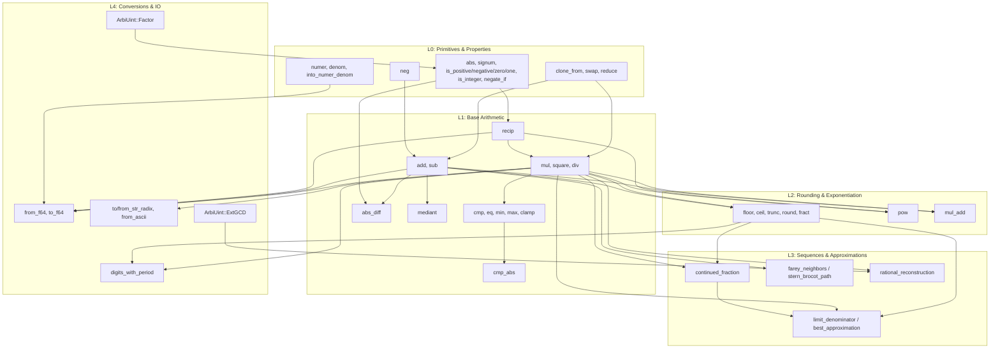

# ArbiRational Implementation Planning

## 0. The Precision System (Delegated)

`ArbiRational` does **not** have its own independent precision metadata field or hierarchy. Instead, it relies entirely on the precision tracking of its constituent parts: `numer: ArbiInt` and `denom: ArbiUint`.

- **Component Precision**: A rational number's precision is simply the precision of its numerator and denominator. They will typically share the same bounds (e.g. if constructed via `ArbiRational::from(1)` in a 256-bit global context), but can technically have asymmetric bounds if explicitly constructed that way.
- **Rule Delegation**: All rules regarding `Context`, `Global`, `Bounded + Unlimited = Unlimited`, and `max(width_a, width_b)` are natively handled by the underlying integer operators when arithmetic is performed on the components.
- **Intermediate Overflows**: See Section 0.1 for the intermediate overflow policy.

### 0.1 Intermediate Overflow Policy
To satisfy the invariant that overflow checks apply only to the *final canonical result*, `ArbiRational` arithmetic algorithms (like addition and multiplication) must perform intermediate coefficient scaling in an unbounded or widening workspace. They then reduce by the final GCD, and only then attempt to fit the canonical result back into the target `max` precision bounds.
**Example**: If two `Bounded(256)` rationals are added, the intermediate unreduced numerator $a \cdot d' + c \cdot b'$ could briefly require 512 bits. The implementation will allocate this temporary 512-bit workspace and only return an overflow error if the *reduced* numerator or denominator still exceeds 256 bits.
- **Mixed-Type Promotion**: `ArbiInt` / `ArbiUint` promote exactly into `ArbiRational` for mixed rational operations. Any operation between `ArbiRational` and `ArbiFloat` promotes to `ArbiFloat`, rounded using the active float target precision and rounding mode.

> **Note:** Bounded precision on rationals is a resource and representation bound over the coefficients. Unlike bounded integers, bounded rationals do not form a closed algebraic structure.

## Type Definition
- **Type**: `InternalArbiRational`
- **Description**: The core data structure for arbitrary precision rational numbers.
- **Invariants**: 
  1. **Strictly Positive Denominator**: `denom > 0`. The sign is exclusively carried by `numer`.
  2. **Canonical Form**: The fraction is always reduced to lowest terms, meaning $\gcd(|numer|, denom) == 1$.
  3. **Normalization of Zero**: `0` is uniquely represented as `0 / 1`.

## Methods

### 1. Parts Management & Constructors
- `new(numer: impl Into<ArbiInt>, denom: impl Into<ArbiUint>) -> Result<Self, RationalError>`: The primary canonical constructor. Generic over primitives. Will reduce by `gcd(n, d)`. Returns `RationalError::NegativeDenominator` if the denominator input would be negative (though signature enforces unsigned denom here, this applies generally).
- `from_parts(numer: ArbiInt, denom: ArbiUint) -> Result<Self, RationalError>`: Accepts `Arbi` types directly. Will reduce by `gcd(n, d)`.
- `new_raw(numer: ArbiInt, denom: ArbiUint) -> Result<Self, RationalError>`: Assumes the input is already reduced (no GCD). Returns `RationalError::NonCanonical` in debug mode if invariants are violated, or `RationalError::DenominatorZero` if `denom == 0`.
- `new_unchecked(numer: ArbiInt, denom: ArbiUint) -> Self`: `unsafe fn`. Caller MUST guarantee: 1) `denom != 0`, 2) `gcd(|numer|, denom) == 1`, and 3) if `numer == 0`, then `denom == 1`.
- `numer` / `denom`: Returns `&ArbiInt` and `&ArbiUint`.
- `into_numer_denom`: Returns `(ArbiInt, ArbiUint)`.

### 2. Core Arithmetic
- `add` / `sub` (Addition and Subtraction):
  - *Implementation Details:* For $x = a/b$ and $y = c/d$, define $g = \gcd(b, d)$, $b' = b/g$, $d' = d/g$. Then $x \pm y = \frac{a d' \pm c b'}{b' d}$. Finally reduce by $h = \gcd(|a d' \pm c b'|, g)$, resulting in $\frac{(a d' \pm c b') / h}{(b' d) / h}$.
- `mul` (Multiplication):
  - *Implementation Details:* Cross-reduction prevents massive allocations: $g_1 = \gcd(|a|, d)$ and $g_2 = \gcd(|c|, b)$. Result: $\frac{(a/g_1) \times (c/g_2)}{(b/g_2) \times (d/g_1)}$.
- `div` (Division):
  - *Implementation Details:* $\frac{a}{b} \div \frac{c}{d} = \frac{a}{b} \times \frac{d}{c}$. Uses the same cross-reduction. The sign of $c$ transfers to the numerator.
- `neg` (Negation):
  - *Implementation Details:* Negates the numerator.
- `square` (Square):
  - *Implementation Details:* $\frac{a^2}{b^2}$. Natively reduced since $\gcd(|a|, b) = 1 \implies \gcd(a^2, b^2) = 1$.
- `pow` (Exponentiation):
  - *Implementation Details:* $\frac{a^k}{b^k}$. Natively reduced. Exponent type is `i32` to prevent accidental memory blowups. Negative exponent calls `recip()` before raising to $|k|$. Zero to a negative exponent returns `RationalError::NegativeExponentOfZero`.
- `try_pow` (Safe Exponentiation with large exponents):
  - *Implementation Details:* Takes `i64` exponent. Returns `Result<Self, PowError>`, estimating the target bitsize ($|exp| \times \max(\text{bits}(a), \text{bits}(b))$) and rejecting it if it exceeds bounds or available memory.
- `pow_assign` / `square_assign` / `recip_assign`:
  - *Implementation Details:* In-place variants for standard mutators.
- `mul_add` (Fused multiply-add):
  - *Implementation Details:* `self * b + c`.
- `mediant` (Mediant of two rationals):
  - *Implementation Details:* $\frac{a+c}{b+d}$. Mathematically between the two fractions. Calls `reduce()` at the end, since the mediant is not guaranteed to be in lowest terms (e.g. $\text{mediant}(\frac{1}{3}, \frac{1}{3}) = \frac{2}{6}$).
- `try_*` (Precision variants):
  - *Implementation Details:* Returns `Result<Self, RationalError>` for precision boundary or allocation failures.
- `checked_*` (Arithmetic variants):
  - *Implementation Details:* Checked arithmetic. Returns `Option<Self>` ONLY for domain errors like division by zero (e.g. `checked_div`). Precision overflows still panic here just like plain operators, consistent with `ArbiInt`.

- `recip` / `checked_recip` (Reciprocal):
  - *Implementation Details:* Swap `numer` and `denom`. If `numer` was negative, transfer `-` to new `numer`. `recip` panics if `numer == 0` (like std integer division by zero). `checked_recip` returns `Option<Self>`.

### 3. Rounding & Truncation
- `round`: rounds half away from zero, matching `f64::round`.
- `round_ties_even`: bankers rounding, matching `f64::round_ties_even`.
- `floor` / `ceil` / `trunc`: Delegate to division semantics.
- `fract` (Fractional part): Uses truncating division semantics, not Euclidean semantics.
- `continued_fraction`: Returns a finite iterator yielding coefficients. Uses floor-division semantics.
- `from_continued_fraction(coeffs: &[ArbiInt])`: Inverse of `continued_fraction`. Coefficients after `coeffs[0]` must be strictly positive. If any $a_i \le 0$ for $i > 0$, returns `RationalError::InvalidFormat`.

### 4. Approximations & Advanced Math
- `best_approximation(max_denom)`
- `best_approximation_with_max_error(error)`
- `lower_approximation(max_denom)`
- `upper_approximation(max_denom)`
- `limit_denominator(max_denom)`: Alias for best approximation within bounds.
- `rational_reconstruction(residue: &ArbiUint, modulus: &ArbiUint, numer_bound: &ArbiUint, denom_bound: &ArbiUint) -> Result<Self, RationalError>`: Reconstructs a rational number from modular data. **Precondition:** `2 * numer_bound * denom_bound < modulus` must hold for a unique reconstruction.
- `farey_neighbors(max_denom)`
- `stern_brocot_path()` / `from_stern_brocot_path(path)`
- `egyptian_fraction()` (Optional `cas` feature).

### 5. Properties & Math
- `abs` / `abs_assign` / `signum`.
- `is_zero`: checks `numer.is_zero()`.
- `is_one`: checks `numer == 1` and `denom == 1`.
- `is_positive`: checks `numer > 0`.
- `is_negative`: checks `numer < 0`.
- `is_integer`: True if `denom == 1`.
- `is_dyadic` / `is_terminating_in_base(b)`.
- `conditional_neg`: Replaces the non-standard `negate_if`. Operates branchlessly, intended for constant-time or crypto usage.

### 6. Conversions, Parsing & Formatting
- `from_str_radix` / `to_string_radix`: 
  - For `from_str_radix(radix)`, scientific notation is only accepted for radix 10 by default.
  - For non-decimal radices: use fraction syntax (`a/b`), point syntax (`a.b`), and scientific notation requires an explicit parser option or distinct exponent marker.
  - If a string in base $r$ has integer part $I$ and fractional part with $k$ digits representing $F$, then the value is $I + \frac{F}{r^k}$.
- `Float Conversions`:
  ```rust
  from_f64_exact(value: f64) -> Result<Self, FloatConversionError>
  from_f32_exact(value: f32) -> Result<Self, FloatConversionError>
  from_f64_approx(value: f64, max_denom: u64) -> Result<Self, FloatConversionError>
  from_f64_within_tolerance(value: f64, tol: ArbiRational) -> Result<Self, FloatConversionError>
  to_f64() -> Option<f64>
  to_f64_lossy() -> f64
  ```
  *(Note: `from_f64_bits` is intentionally omitted to avoid semantic clashes with `ArbiInt::from_f64_bits` which interprets bits as a literal integer. To decode a float from bits, use `from_f64_exact(f64::from_bits(bits))`.)*
  - `to_f64` follows `num_traits::ToPrimitive` expectations. Returns `None` if the exact value overflows `f64::MAX` to infinity.
- **Cross-Type Conversions**:
  - `From<ArbiInt>` and `From<ArbiUint>` to `ArbiRational` (infallible, `denom=1`).
  - `From<i32>`, `From<i64>`, etc. (infallible).
- **Formatting (`core::fmt`)**:
  - `Display`: exact `a/b`, or `a` when denominator is 1.
  - `Binary`, `Octal`, `LowerHex`, `UpperHex`: exact `numer/denom` formatting in the selected radix.
  - `LowerExp` and `UpperExp`: Implemented in v1 as rounded decimal formatting controlled by `Formatter::precision`, using base 10 with `floor(log10(|self|))` as the exponent.

### 7. Iterators
- `to_radix_fractional(base, max_digits)`: Returns a bounded `Vec<u32>` of fractional digits.
- `fractional_digits(base)`: Returns a potentially infinite `Iterator<Item = u32>` of fractional digits.
- `digits_with_period(base: u32) -> Result<(Vec<u32>, Vec<u32>), RationalError>` (requires base >= 2).

### 8. Comparisons & Equality
- `cmp` / `eq` / `cmp_abs` / `abs_diff` / `min` / `max` / `clamp`.
- When cross-comparing with `f64`, converts `f64` strictly to exact `ArbiRational` via `from_f64_exact` to avoid false positives.

### 9. Memory Management
- `clone_from` / `swap`.
- `capacity(&self) -> (usize, usize)`: Returns tuple of (numer_limbs, denom_limbs).
- `reserve(numer_limbs: usize, denom_limbs: usize)`
- `shrink_to_fit()`.

### 10. Ecosystem & Randomness
- **Hash Guarantees**: The sequence of fields fed into `Hash` is deterministic and canonical. Therefore, for the same `Hasher` implementation and seed, equal rationals hash identically across platforms.
- **Cross-Type Contract**: `ArbiRational` is the exact middle layer of the numeric tower (`int -> rational -> float`). It must preserve exactness when receiving integers and must yield to `ArbiFloat` when mixed with approximate floating values.
- **Serialization**: Binary serialization is deterministic only for the crate-defined canonical serialization format, not necessarily for arbitrary `serde` backends.
- **Randomness (`rand`)**:
  - No `Standard` distribution is implemented.
  - Random generation is exposed through explicit constructors: `random_with_denominator_bits`, `random_with_max_denominator`, `random_canonical_in_range`. `random_canonical_in_range` is uniform over rationals with a denominator bounded by the ambient global/context precision limit.

## 11. Errors
```rust
pub enum RationalError {
    DenominatorZero,
    NegativeDenominator,
    PrecisionExceeded,
    DivisionByZero,
    NegativeExponentOfZero,
    InvalidRadix,
    InvalidDigit,
    InvalidFormat,
    NonFiniteFloat,
    NegativeTolerance,
    MaxDenominatorZero,
    AllocationRequired,
    TooLarge,
    NonCanonical,
    IntegerError(ArbiError),
}
```
*Note: Operations that propagate integer domain/precision errors wrap them in `RationalError::IntegerError`.*

## 12. Internal Function Dependency Graph



